# Documentazione di Progetto: Gestione-esami-universitari

## Sommario

Questo documento raccoglie in modo coeso tutte le informazioni estratte dai file di documentazione originali del progetto **Gestione-esami-universitari**, trasponendo i diagrammi nel formato testuale Mermaid e organizzandoli secondo una gerarchia logica che va dai requisiti all'implementazione tecnica. Il sistema è un'applicazione web per il tracciamento della carriera universitaria, sviluppata con un frontend MVP in Vanilla JavaScript, un backend PHP nativo e un database PostgreSQL, il tutto orchestrato tramite Docker Compose.

---

## Indice

1. [Specifiche dei Requisiti Software (SRS)](#1-specifiche-dei-requisiti-software-srs)
   - 1.1 [Classi di Utenti](#classi-di-utenti)
   - 1.2 [Vincoli Espliciti e Requisiti Non Funzionali](#vincoli-espliciti-e-requisiti-non-funzionali)
   - 1.3 [Moduli Funzionali Chiave](#moduli-funzionali-chiave)
2. [Analisi dei Casi D&#39;Uso (Use Cases)](#2-analisi-dei-casi-duso-use-cases)
   - 2.1 [Diagramma dell&#39;Architettura del Sistema](#diagramma-dellarchitettura-del-sistema-visualizzazione-logica)
   - 2.2 [Relazione dei Casi D&#39;Uso](#relazione-dei-casi-duso)
   - 2.3 [Flusso di Sequenza: Da Utente a Database](#flusso-di-sequenza-da-utente-a-database)
3. [Architettura di Sistema e Deployment](#3-architettura-di-sistema-e-deployment)
   - 3.1 [Diagramma delle Classi Principali](#diagramma-delle-classi-principali-class-diagram)
   - 3.2 [Database Component Diagram](#database-component-diagram)
   - 3.3 [Deployment Diagram](#deployment-diagram)
   - 3.4 [Inizializzazione Database](#inizializzazione-database-sequence)
4. [Frontend: Architettura MVP](#4-frontend-architettura-mvp)
   - 4.1 [ExamModel](#exammodel)
   - 4.2 [ExamView](#examview)
   - 4.3 [ExamPresenter](#exampresenter)
5. [Backend: Componenti Core](#5-backend-componenti-core)
   - 5.1 [Componente Router](#51-componente-router)
   - 5.2 [Componente Request](#52-componente-request)
   - 5.3 [Componente Response](#53-componente-response)
6. [Persistenza: Componente Database](#6-persistenza-componente-database)
   - 6.1 [Schema Entity-Relationship (ER)](#schema-entity-relationship-er)
   - 6.2 [Repository Pattern](#repository-pattern)
7. [Livello API e Contratti (REST)](#7-livello-api-e-contratti-rest)
   - 7.1 [Standardizzazione della Risposta](#standardizzazione-della-risposta-response-envelope)
   - 7.2 [Endpoints Principali](#endpoints-principali-definiti)
8. [Modulo Statistiche e Sicurezza](#8-modulo-statistiche-e-sicurezza)
   - 8.1 [Strategy Pattern (Statistiche)](#design-pattern-strategy-pattern-statistiche)
   - 8.2 [Repository Pattern (Data Access)](#design-pattern-repository-pattern-data-access)
   - 8.3 [Middleware Pattern (Sicurezza)](#design-pattern-middleware-pattern-sicurezza)
   - 8.4 [Flusso Completo API Statistiche](#flusso-completo-api-statistiche)
9. [Gestione della Sicurezza](#9-gestione-della-sicurezza)

---

## 1. Specifiche dei Requisiti Software (SRS)

**Fonte**: `docs/software_requirements_document.pdf`

Il Sistema di Gestione Esami è un'applicazione web autonoma progettata per permettere agli studenti universitari di tracciare, analizzare e proiettare il loro rendimento accademico.

### Classi di Utenti

1. **Utente Ospite**: Livello di accesso limitato. Può esplorare pagine pubbliche, registrarsi al sistema o effettuare il login, ma non può inserire o visualizzare dati accademici privati.
2. **Utente Registrato (Studente)**: Accesso completo all'applicativo. Gestisce i propri esami, visualizza statistiche e calcola proiezioni in modo isolato (Multi-Tenancy).
3. **Amministratore**: Visione globale sul sistema per controlli e supervisione avanzata (opzionale/futura implementazione).

### Vincoli Espliciti e Requisiti Non Funzionali

- Stack Frontend: **HTML, CSS, Vanilla JavaScript** (Nessun framework reattivo come React/Vue).
- Pattern Frontend: obbligo di utilizzare il **Model-View-Presenter (MVP)**.
- Stack Backend: **PHP** senza l'ausilio di framework esterni (no Laravel/Symfony).
- Architettura d'interfacciamento: comunicazione solo via API **RESTful** JSON.
- Design Patterns: impiego di almeno 2 pattern di progettazione accademici per modulare il software.

### Moduli Funzionali Chiave

1. **Autenticazione e Sicurezza (RF-01, RF-02)**: Meccanismi di registrazione e Login. Il sistema deve prevenire brute-forcing tramite Rate Limiting IP (5 tentativi l'ora) e blocchi account temporanei. Le password devono possedere una certa complessità e subire un corretto processo di cifratura/hashing.
2. **Gestione Esami (RF-04, 05, 06)**: Lo studente deve poter operare CRUD sugli esami. Vi è validazione logica stringente: nessuna data nel futuro, i voti devono ricalcare la metrica europea (18-30 o Lode), i CFU devono essere corretti. Qualsiasi modifica riflette automaticamente nuovi valori statistici in tempo reale.
3. **Calcoli Statistici (RF-07, 08)**: Calcolo automatico di Media Aritmetica, Media Ponderata, Crediti totali/rimanenti. Proiezione del voto di laurea derivata matematicamente (stima conservativa).
4. **Visualizzazione (RF-09, 10)**: Istogrammi di distribuzione voti, linea della media ponderata temporale e cruscotto Dashboard unificato che raccoglie in breve le metriche più vitali della propria carriera.

---

## 2. Analisi dei Casi D'Uso (Use Cases)

**Fonte**: `docs/use_cases_model.pdf`

Questa sezione descrive i flussi operativi e l'interazione degli attori con il sistema dall'alto livello applicativo.

### Diagramma dell'Architettura del Sistema (Visualizzazione Logica)

Come delineato dalle specifiche dei casi d'uso, l'applicativo mantiene una stretta direttiva MVP per il frontend, il quale dialoga con una divisione logica e a strati del backend PHP.

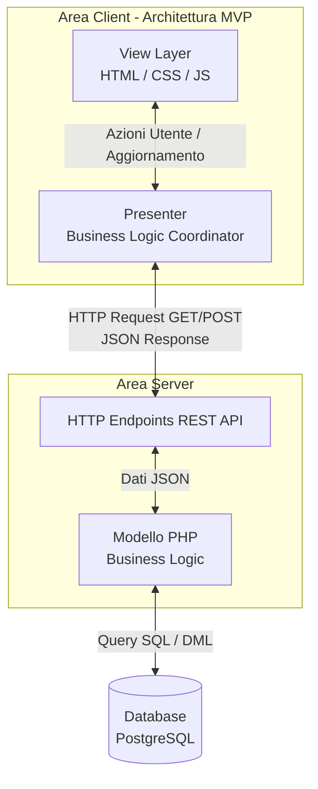

### Relazione dei Casi D'Uso

Tutte le interazioni ruotano attorno allo `Studente`, considerato attore protagonista primario per la stragrande maggioranza dei flussi.

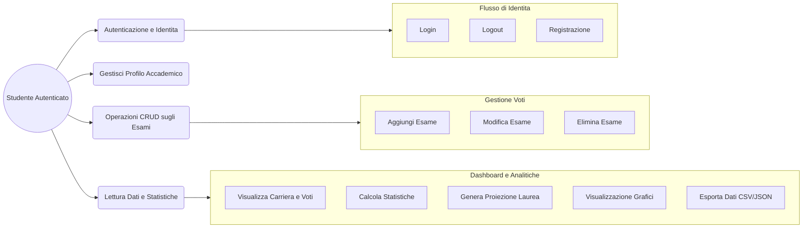

### Flusso di Sequenza: Da Utente a Database

L'esempio chiave di flusso completo (vertical slice) è visibile nel processo di tracciamento di una registrazione (caso applicabile idealmente anche all'inserimento di un esame).

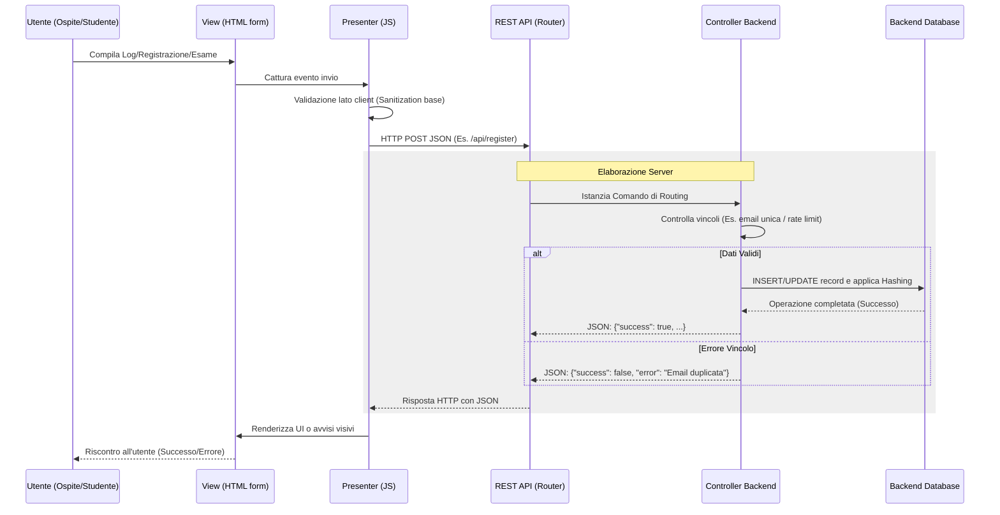

---

## 3. Architettura di Sistema e Deployment

### Diagramma delle Classi Principali (Class Diagram)

Rappresentazione della struttura orientata agli oggetti con i layer isolati Front-end e Back-end.

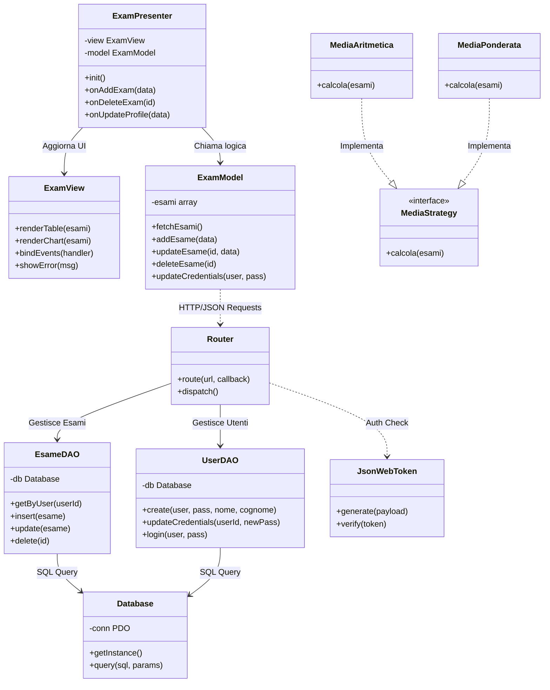

### Database Component Diagram

Il diagramma dei componenti illustra la struttura ad alto livello e le interazioni tra i componenti principali dell'applicazione.

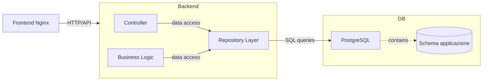

### Deployment Diagram

Organizzazione dei container sul Docker Host.

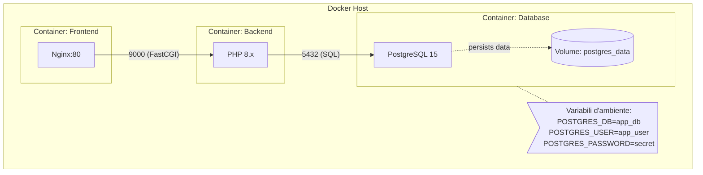

### Inizializzazione Database (Sequence)

Flusso di avvio del database e mount dei volumi da parte di Docker Compose.

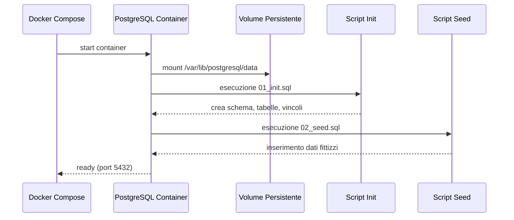

### Diagramma di Attività: Inizializzazione Database

Flusso delle operazioni per il primo avvio dei container e inizializzazione del database.

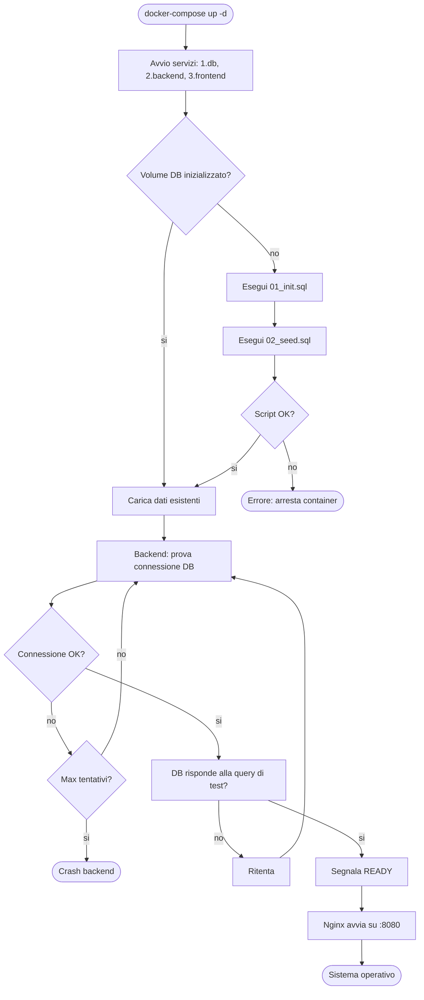

---

## 4. Frontend: Architettura MVP

**Fonte**: `docs/Architettura MVP-wiki.pdf`

Il frontend è sviluppato seguendo l'Architettura MVP (Model-View-Presenter).
L'obiettivo di questa architettura è rendere il codice più manutenibile, facilitare il testing e separare la logica di business, l'interfaccia grafica e la logica di coordinamento.

Sono state sviluppate 3 classi fondamentali: `ExamModel`, `ExamView` e `ExamPresenter`.

### ExamModel

Gestisce la logica di Business e i dati. Nel progetto rappresenta il cuore logico dell'applicazione:

- Contiene i dati degli esami.
- Gestisce le operazioni della CRUD (Create – Read – Delete) attraverso le rispettive funzioni: `add(esame)`, `getAll()`, `remove(id)`.
- Calcola le statistiche (media aritmetica, media ponderata, proiezione voto di laurea).

*Nota: Inizialmente `ExamModel` utilizzava dati Mock, simulando un backend reale.*

### ExamView

Si occupa principalmente della proiezione grafica.
Nel progetto:

- Disegna la tabella degli esami.
- Aggiorna i valori delle statistiche.
- Intercetta le azioni dell'utente, per esempio il "click".
- Non conosce il model.
- Non contiene la logica di business.
- Espone solo metodi come: `renderTable`, `updateStats`, `bindAddExam`.

### ExamPresenter

È il componente centrale dell'MVP, il suo ruolo è:

- Ricevere eventi dalla View.
- Chiedere i dati al Model.
- Aggiornare la View con i risultati.

Nel progetto il Presenter:

- Inizializza l'applicazione.
- Recupera la lista degli esami dal Model.
- Aggiorna la tabella e le statistiche.
- Gestisce l'aggiunta e l'eliminazione degli esami.

### Flusso di funzionamento dell'applicazione

1. L'utente apre la pagina.
2. Il file `main.js` crea:
   - `ExamModel`
   - `ExamView`
   - `ExamPresenter`
3. Il Presenter inizializza l'applicazione.
4. Il Model fornisce i dati.
5. La View visualizza questi ultimi (i dati).
6. Ogni iterazione passa dal Presenter.

Questo garantisce un flusso ordinato e prevedibile.

### Conclusione

L'adozione dell'architettura MVP ha permesso di strutturare il progetto in modo ordinato e scalabile, rendendo chiaro il ruolo di ogni componente. Anche in assenza del backend definitivo, l'uso di dati Mock ha consentito di sviluppare e testare il frontend in modo realistico.

---

## 5. Backend: Componenti Core

Il backend è progettato per essere robusto, sicuro e modulare tramite l'uso di pattern di design specifici. I tre componenti fondamentali sono il **Router**, la **Request** e la **Response**, ognuno con un pattern architetturale dedicato.

### 5.1 Componente Router

**Fonte**: `docs/documentazione_router.pdf`

Il componente `Router` è il punto d'ingresso principale dell'applicazione backend. Smista dinamicamente le richieste in entrata verso le specifiche aree applicative (endpoints).

#### Scelte Architetturali

1. **Separazione delle Preoccupazioni**: Il Router si occupa esclusivamente di tradurre un URI in un comando, mantenendosi agnostico sulla logica di business. I singoli endpoints (`Commands`) non conoscono i dettagli del routing.
2. **Caricamento Route basato su File (`endpoints.txt`)**: Per evitare hardcoding, le associazioni URI-Comando sono definite in testo piano. L'estensibilità (aggiunta di una route) è possibile semplicemente creando il file Comando e aggiungendo una riga di testo, senza toccare il Router.
3. **Validazione Multi-Livello**: Assicura che una richiesta non prosegua mai se non rispetta le regole base (Route esistente -> Metodo HTTP corretto -> Classe Command definita -> Interfaccia Command implementata correttamente).

#### Design Pattern: Command Pattern

Il cuore del router è strutturato utilizzando il Pattern Command. Questo pattern incapsula e trasforma una richiesta in un oggetto a sé stante ("Command"), disaccoppiando chi invoca l'operazione (il Router) da chi sa come eseguirla (il Receiver / Endpoint).
**Perchè**: Senza il Pattern Command si finirebbe ad ottenere un immenso blocco `switch-case` instradante. L'adozione del pattern Command consente una modularità pressoché infinita. L'esecuzione dei vari receiver resta pulita e fortemente testabile.

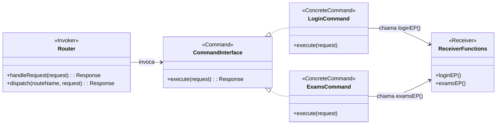

#### Architettura di Sistema Globale

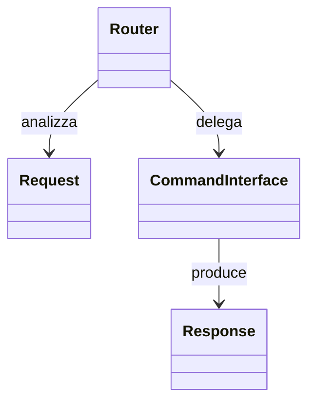

#### Flusso Completo di Routing (Sequence Diagram)

Una singola richiesta scorre all'interno delle componenti secondo questa sequenza logica.

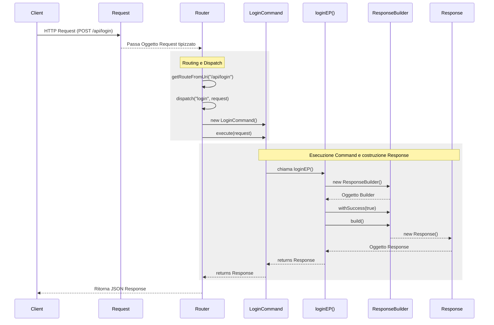

#### Gestione degli Errori nel Router

Ogni operazione logica viene controllata con uno schema ad albero. In caso di fallimento in un qualsiasi snodo, il processing viene interrotto per restituire un JSON di errore coerente senza lanciare fatal error applicativi.

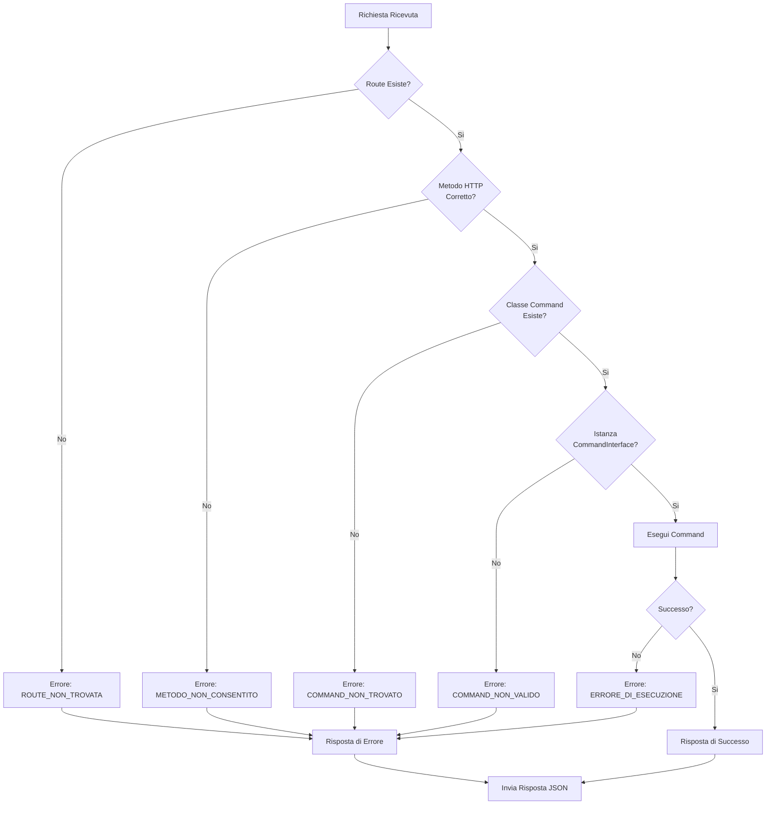

---

### 5.2 Componente Request

**Fonte**: `docs/documentazione_request.pdf`

La classe `Request` rappresenta un wrapper object-oriented per le richieste HTTP. Funge da livello di astrazione per isolare l'applicazione dall'accesso diretto alle variabili superglobali di PHP (`$_SERVER`, `$_POST`, `$_GET`), migliorando sicurezza e testabilità.

#### Scelte Architetturali e di Sicurezza

L'architettura della classe `Request` è stata progettata con un focus sulla robustezza:

1. **Type Safety e Null Safety**: Tutte le proprietà e i metodi utilizzano dichiarazioni di tipo rigorose. In assenza di valori, i metodi restituiscono `null` o valori di default sicuri, prevenendo *type confusion vulnerabilities*.
2. **Immutabilità**: Una volta creata, un'istanza `Request` non può essere modificata. Questo previene alterazioni impreviste della richiesta durante il ciclo di vita dell'applicazione.
3. **Nessun Accesso Diretto alle Superglobali**: La logica di business e il Router interagiscono esclusivamente con l'oggetto `Request`.
4. **Header Case-Insensitive**: Previene attacchi di injection basati su variazioni del capitalizzazione (es. `CONTENT-TYPE` vs `Content-Type`).

#### Design Pattern: Factory Pattern

Per l'istanziazione, la classe utilizza un approccio basato su *Factory Method* (`createBaseRequest()`).
**Perchè**: Centralizza la logica di estrazione dei dati crudi dalle superglobali PHP, fornendo un singolo punto in cui avviene l'analisi e la validazione iniziale, e consentendo inoltre di creare istanze "manuali" per finalità di mock e unit testing.

#### Flusso di Elaborazione della Richiesta HTTP

Questo diagramma mostra come i dati grezzi provenienti dal web server vengano trasformati in un oggetto tipizzato `Request`.

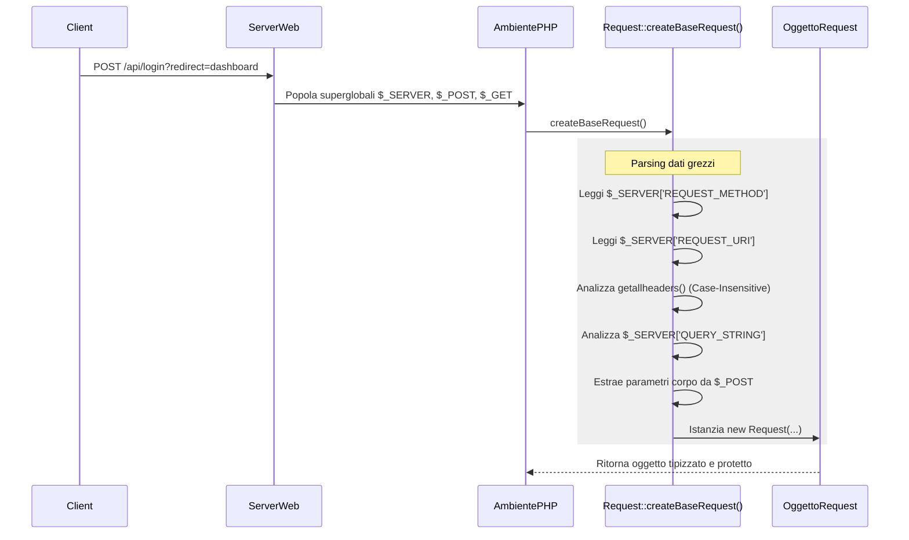

#### Modello del Flusso dei Dati (Data Flow)

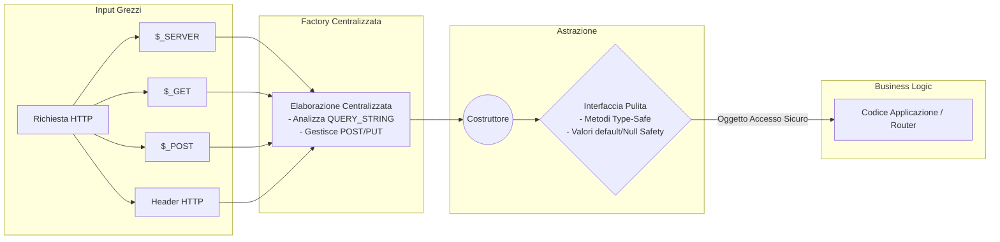

#### Esempio Completo: Flusso di Login tramite Request

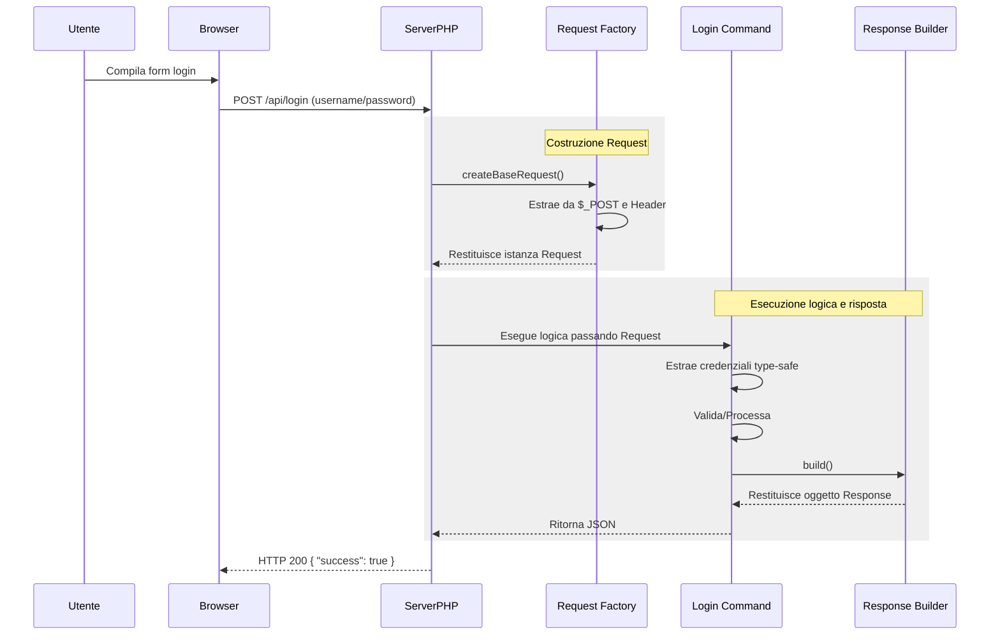

#### Integrazione con il Sistema Router (Command Pattern)

L'oggetto `Request` viene passato al Router, il quale incapsula ciascun endpoint sotto forma di un "Comando".

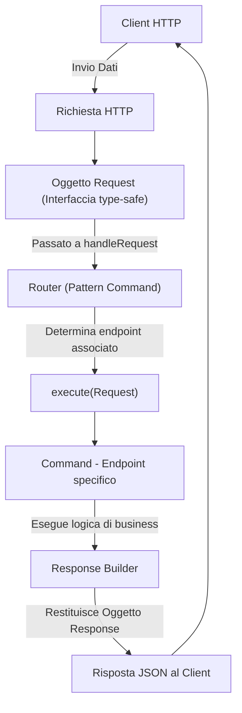

---

### 5.3 Componente Response

**Fonte**: `docs/documentazione_response.pdf`

Il componente `Response` gestisce le risposte JSON emesse dalle API verso il client. È stato progettato per centralizzare la creazione delle risposte, assicurando che tutti gli endpoint restituiscano un formato prevedibile, coerente e sicuro.

#### Scelte Architetturali e di Sicurezza

L'obiettivo principale del componente Response è la consistenza. Le decisioni chiave prese dal punto di vista dell'architettura includono:

1. **Oggetti Immutabili**: La classe `Response` non espone alcun metodo "setter". Una volta creata l'istanza finale, i dati non possono essere manipolati; questo minimizza gli effetti collaterali e i bug imprevisti nel momento dell'emissione dell'output.
2. **Standardizzazione del JSON**: Ogni risposta ha necessariamente i campi `success`, `message`, `endpoint` e `auth`. Codici di errore e payload addizionali (`data`) sono opzionali, garantendo che i client sappiano sempre cosa aspettarsi.
3. **Validazione Integrata**: Controlli rigorosi prevengono la creazione della Response se i dati critici (es. `endpoint`) sono mancanti.
4. **Fallback per Errori JSON**: In caso di fallimento della codifica JSON (ad es. per encoding non valido o riferimenti circolari), il componente intercetta l'errore e fornisce una risposta JSON di errore predefinita anziché generare output malformato.
5. **Incapsulamento in un Singolo File**: Entrambe le classi (`Response` e `ResponseBuilder`) risiedono nello stesso file per mantenere l'integrità del pattern ed evitare problemi di visibilità in PHP.

#### Design Pattern: Builder Pattern

La creazione della `Response` segue il Pattern Builder, fondamentale a causa del numero di attributi opzionali e obbligatori.
**Perchè**: Invece di avere un costruttore monolitico estremamente verboso, la separazione in una classe `ResponseBuilder` permette una creazione "step-by-step" con interfacce fluenti (chaining dei metodi come `->withSuccess()->withData()`). Ciò massimizza la leggibilità, accentra la logica di validazione nel metodo finale `build()` e mantiene la classe `Response` totalmente immutabile, senza alcun setter.

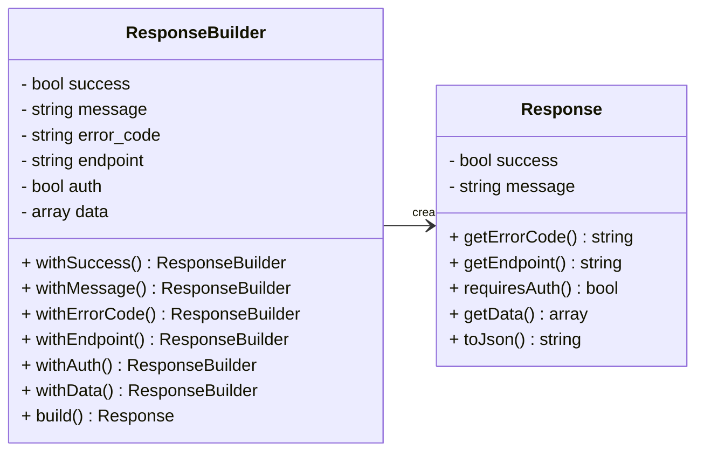

#### Flusso di Gestione degli Errori e Costruzione (Data Flow)

Questo diagramma mostra il processo completo che il Builder esegue per istanziare e produrre l'output finale, includendo tutti i passaggi di validazione e la fallback di codifica.

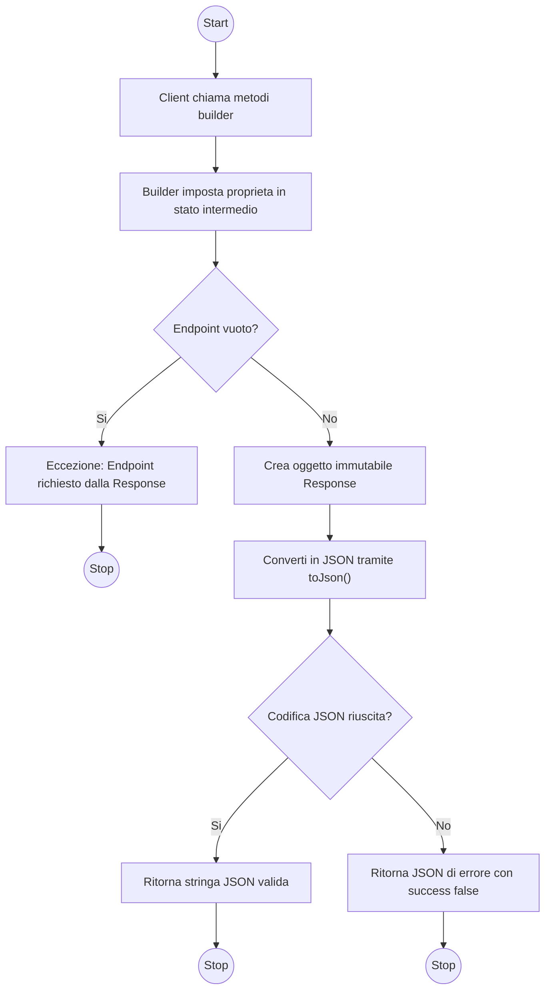

---

## 6. Persistenza: Componente Database

**Fonte**: `docs/Componente_database.pdf`

Il database rappresenta il livello di persistenza dell'applicazione "Gestione Esami" ed è responsabile della gestione dei dati relativi agli utenti, corsi, esami, insegnamenti e carriere. Implementato su **PostgreSQL 13**.

### Analisi dei Requisiti e Modello Concettuale (ER)

#### Entità Principali

- **Utente**: l'utente dell'applicazione.
- **Carriera**: la carriera dello studente.
- **Corso**: corso di laurea a cui un utente è associato.
- **Insegnamento**: un insegnamento previsto all'interno di un corso.
- **Esame**: un esame sostenuto (o registrato) da un utente per uno specifico insegnamento.

#### Schema Entity-Relationship (ER)

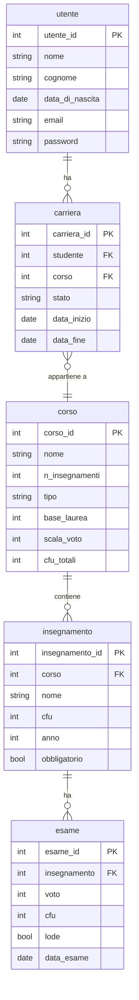

### Vincoli e Integrità dei Dati

- **Integrità di entità**: Chiavi primarie su tutte le tabelle.
- **Integrità referenziale**: Relazioni tramite `FOREIGN KEY` rigide.
- **Unicità e Dominio**: L'email dell'utente è unica (`UNIQUE`), i voti ecc. sono soggetti a limitazioni semantiche (`CHECK`).

### Repository Pattern

L'accesso al DB dal Backend avviene unicamente tramite il Repository Pattern (es. `UtenteRepository`, `CarrieraRepository`, ecc.), separando chiaramente la business logic dalle query SQL e prevenendo vulnerabilità SQL Injection usando prepared statements.

### Diagramma di Attività: Inserimento Nuovo Utente

Flusso di comunicazione dal client al database per la registrazione.

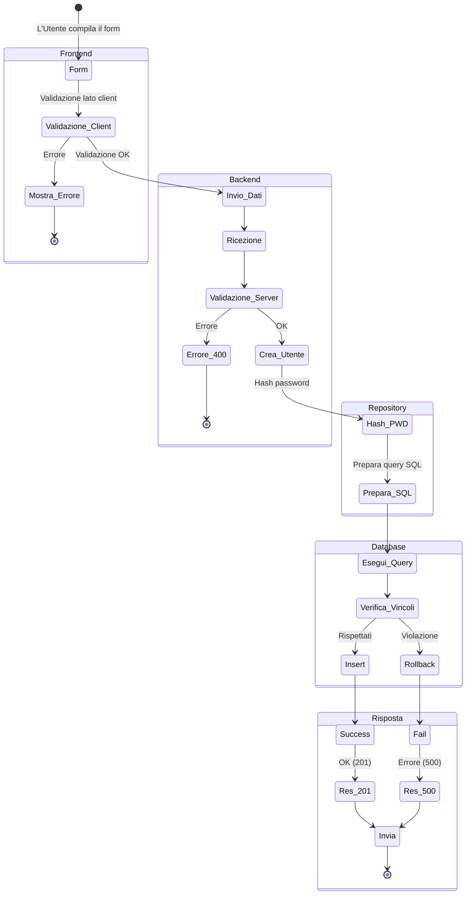

### Inizializzazione Database

Il database è orchestrato via Docker Compose. Al primo avvio, se il volume persistente non è inizializzato, PostgreSQL esegue automaticamente `01_init.sql` (struttura e vincoli) e `02_seed.sql` (dati fittizi). Questo implementa il pattern **Factory Method**.

### Modifiche al Database

È stata aggiunta la ForeignKey `studente` alla tabella `esame` riferita a `utente(utente_id)` per implementare il partizionamento dei dati (multi-tenancy) e garantire l'integrità referenziale automatica tramite `ON DELETE CASCADE`.

### Test

Suite di test manuali implementati in PHP per verificare connessioni e Repository, non usando direttamente query lato Frontend/Backend Controller.

---

## 7. Livello API e Contratti (REST)

**Fonte**: `docs/Contratto API REST – Gestione Esami.pdf`

Il documento definisce il contratto di interfaccia REST tra Frontend e Backend (versione 1.0) garantendo un'integrazione chiara tramite formato JSON. Il backend espone servizi tramite API REST, seguendo una convenzione di formattazione JSON sia per l'input (richieste del client) che per l'output (risposte del server gestite dalla classe `Response`).

### Configurazione Generale

- **Base URL**: `http://localhost:8080/api`
- **Formato dati**: `application/json`
- **Autenticazione**: JWT tramite HTTP Header (`Authorization: Bearer <token_jwt>`). Richiesta obbligatoriamente per tutte le rotte eccetto Login e Register.

### Standardizzazione della Risposta (Response Envelope)

Ogni risposta mandata al client condivide una struttura comune, per facilitare il parsing globale nel frontend (es. intercettando globalmente un token scaduto o un fallimento):

```json
{
  "success": true,
  "endpoint": "/api/esami",
  "auth": true,
  "message": "Operazione completata con successo",
  "data": { ... }
}
```

La standardizzazione della response JSON per errori include sempre:

```json
{
  "success": false,
  "error_code": "...",
  "message": "..."
}
```

*Nota: Le date seguono lo standard ISO 8601.*

### Endpoints Principali Definiti

1. **Autenticazione**:

   - `POST /api/login`: Validazione credenziali (email, password). Autentica un utente restituendo un token JWT e i dati base (id, nome, cognome).
   - `POST /api/register`: Creazione account con hashing password (`password_hash`). Registra un nuovo studente nel sistema. Restituisce un 201 Created.
   - `GET /api/logout`: Chiusura sessione.
   - `GET /api/session`: Restituisce lo stato attuale dell'autenticazione.
2. **Gestione Esami (CRUD)**:

   - `GET /api/esami`: Ottiene l'elenco degli esami per l'utente loggato (restituisce materia, voto, lode, cfu, data).
   - `POST /api/esami`: Aggiunge un nuovo esame (con validazione CFU, Mese/Anno).
   - `PUT /api/esami/{id}`: Modifica un esame esistente posseduto.
   - `DELETE /api/esami/{id}`: Elimina un esame (solo dell'utente attivo).
3. **Statistiche & Reporting**:

   - `GET /api/stats`: Calcola la media (ponderata, aritmetica, previsionale) in tempo reale applicando i *Strategy Patterns* sulle righe filtrate. Il server restituisce calcoli basati su una o più Strategy (media aritmetica, media ponderata, cfu totali, esami sostenuti, proiezione voto di laurea).

---

## 8. Modulo Statistiche e Sicurezza

**Fonte**: `docs/Documentazione_statistiche_sicurezza.pdf`

Questo modulo copre l'analisi dettagliata dei moduli Statistiche (Analytics) e Sicurezza (Auth) del sistema "Gestione Esami". Descrive i requisiti funzionali, l'architettura a 3 layer, i design pattern e il processo iterativo di sviluppo.

### Requisiti Funzionali

- **Statistiche**: Calcolo medie (aritmetica e ponderata), proiezioni e forecasting (voto di laurea), analisi avanzate (distribuzione voti, trend temporale).
- **Sicurezza**: Autenticazione (login/logout tramite JWT), multi-tenancy e isolamento dati (ogni utente vede solo i propri esami).

### Requisiti Non Funzionali

- Performance rapide (< 200ms per API statistiche).
- Sicurezza con password hashate via bcrypt.
- Manutenibilità (Open/Closed Principle) e Testabilità.

### Design Pattern: Strategy Pattern (Statistiche)

Incapsula ogni algoritmo di calcolo in una classe dedicata, facilitando l'estensione senza modificare il controller.

```mermaid

classDiagram
    class StatsController {
        +statsEP()
        +getStatsData(userId)
    }

    class MediaStrategy {
        <<interface>>
        +calcola(esami)
    }
  
    class DistribuzioneVotiStrategy {
        +calcola(esami)
    }
  
    class TrendMedieStrategy {
        +calcola(esami)
    }

    class MediaAritmetica {
        +calcola(esami)
    }

    class MediaPonderata {
        +calcola(esami)
    }

    class MediaPrevisionale {
        +calcola(mediaCorrente, cfuFatti, cfuTotali, targetVoto)
    }

    StatsController --> MediaStrategy
    StatsController --> DistribuzioneVotiStrategy
    StatsController --> TrendMedieStrategy
    MediaStrategy <|-- MediaAritmetica
    MediaStrategy <|-- MediaPonderata
    MediaStrategy <|-- MediaPrevisionale
```

### Design Pattern: Repository Pattern (Data Access)

Centralizzazione di tutte le query in Repository dedicate (es. `EsameRepository`, `UtenteRepository`), permettendo di incapsulare l'isolamento dei dati.

```mermaid

sequenceDiagram
    participant Controller
    participant EsameRepository
    participant Database

    Controller->>EsameRepository: findByStudent(userId)
    EsameRepository->>Database: SELECT ... WHERE studente = :id
    Database-->>EsameRepository: Rowset (Solo dati utente)
    EsameRepository-->>Controller: Array Esami
```

### Design Pattern: Middleware Pattern (Sicurezza)

Crea un componente che intercetta tutte le richieste per convalidare l'autenticazione prima del controller.

```mermaid

sequenceDiagram
    participant Router
    participant AuthMiddleware
    participant Controller

    Router->>AuthMiddleware: isAuthenticated()
    Note over AuthMiddleware: Controllo $_SESSION['user_id']
    alt Sessione Valida
        AuthMiddleware-->>Controller: userId
    else Sessione Non Valida
        AuthMiddleware-->>Router: 401 Unauthorized (Exit)
    end
```

### Flusso di Login

```mermaid

sequenceDiagram
    participant Client
    participant LoginController
    participant UtenteRepository
    participant Sessione

    Client->>LoginController: POST /login (email, pwd)
    LoginController->>UtenteRepository: findByEmail(email)
    UtenteRepository-->>LoginController: utente['password_hash']
    Note over LoginController: password_verify(pwd, hash)
    alt Password OK
        LoginController->>Sessione: session_start()
        LoginController->>Sessione: set user_id
        LoginController-->>Client: 200 OK + User Info
    else Errore
        LoginController-->>Client: 401 Unauthorized
    end
```

### Flusso Completo API Statistiche

```mermaid
sequenceDiagram
    participant Client
    participant Router
    participant AuthMiddleware
    participant StatsController
    participant EsameRepository
    participant Database
    participant Strategies

    Client->>Router: GET /api/stats
    Router->>AuthMiddleware: isAuthenticated()
    alt Session Valid
        AuthMiddleware-->>StatsController: userId
        rect rgba(128, 128, 128, 0.13)
        Note over StatsController: getStatsData(userId)
        StatsController->>EsameRepository: findByStudent(userId)
        EsameRepository->>Database: SELECT * FROM esame WHERE studente = :id
        Database-->>EsameRepository: ResultSet
        EsameRepository-->>StatsController: ArrayEsami
        StatsController->>Strategies: MediaAritmetica.calcola()
        Strategies-->>StatsController: float
        StatsController->>Strategies: MediaPonderata.calcola()
        Strategies-->>StatsController: float
        StatsController->>Strategies: MediaPrevisionale.calcola()
        Strategies-->>StatsController: float
        StatsController->>Strategies: DistribuzioneVoti.calcola()
        Strategies-->>StatsController: array
        StatsController->>Strategies: TrendMedie.calcola()
        Strategies-->>StatsController: array
        end
        StatsController-->>Client: 200 OK + JSON Stats
    else Session Invalid
        AuthMiddleware-->>Client: 401 Unauthorized
    else Database Error
        Database-->>StatsController: Exception
        StatsController-->>Client: 500 Internal Server Error
    end
```

### Ciclo di Vita della Sessione

```mermaid

stateDiagram-v2
    [*] --> UtenteGuest
    state UtenteGuest {
        login: POST /login\nVerifica Credenziali
    }
    UtenteGuest --> SessioneAttiva : Successo
    UtenteGuest --> UtenteGuest : Errore
  
    state SessioneAttiva {
        stats: GET /stats
        calc: Calcolo Statistiche
        json: JSON
        stats --> calc
        calc --> json
    }
    SessioneAttiva --> [*] : Logout
```

---

## 9. Gestione della Sicurezza

Il sistema è progettato tenendo in considerazione le vulnerabilità classiche (OWASP Top 10).

| Vulnerabilità                                  | Soluzione Architetturale adottata                                                                                                                                                                                                                                            |
| :---------------------------------------------- | :--------------------------------------------------------------------------------------------------------------------------------------------------------------------------------------------------------------------------------------------------------------------------- |
| **SQL Injection**                         | Tutti i parametri nel database (`EsameDAO`, `UtenteDAO`) passano per l'oggetto `DatabaseWrapper` che sfrutta *PDO Prepared Statements* vincolanti (`stmt->execute(params)`), rendendo impossibile l'iniezione del codice SQL.                                      |
| **Cross-Site Scripting (XSS)**            | Misure lato Front-end per validazione rigorosa su tutti i campi; popolamento sicuro del DOM usando metodi come `.textContent` anziché `.innerHTML` per iniettare le risposte o dati.                                                                                    |
| **Bypass Controllo degli Accessi (IDOR)** | Ogni chiamata dipendente da uno student ID (es. Modifica o Eliminazione Esame) NON si affida a parametri espliciti facilmente falsificabili dal client (es.`?user_id=123`), ma preleva l'identificatore del *Tenant* direttamente dalla *Sessione Server Autenticata*. |
| **Data Exposure e Crittografia**          | Le password utente non viaggiano e non permangono in chiaro; vengono conservate sul DB utilizzando l'algoritmo bcrypt nativo (`PASSWORD_BCRYPT`).                                                                                                                          |
| **Mass Assignment**                       | Il componente `Request` (unitamente ai vari Controller) preleva rigorosamente dal payload in entrata solo le chiavi attese, scartando campi accessori malevoli (es. iniezione forzata di `admin=true`).                                                                  |
