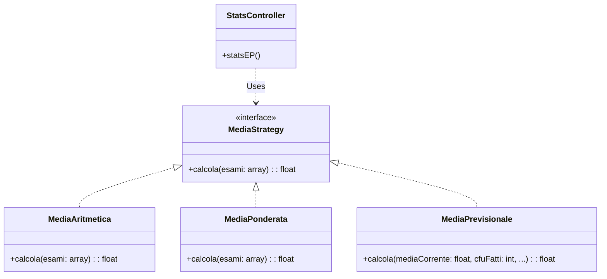
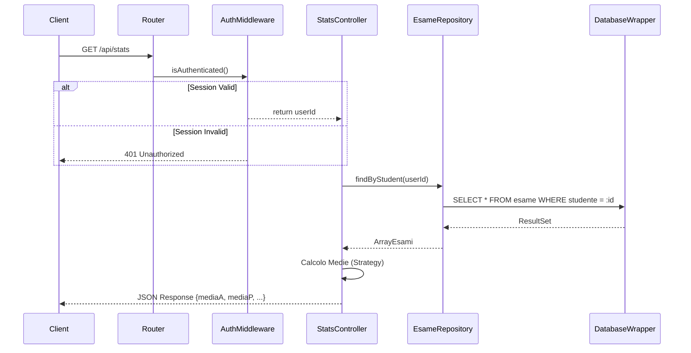
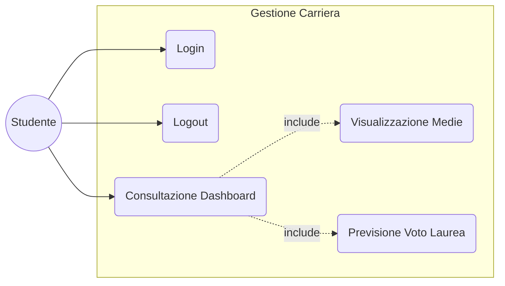
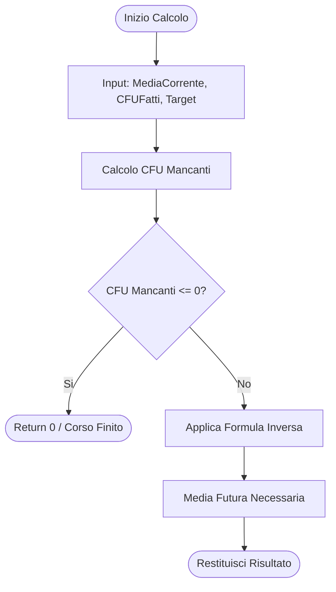

# Documentazione Completa: Gestione Esami (Modulo Statistiche & Sicurezza)

Questo documento costituisce il riferimento tecnico completo per le implementazioni relative ai moduli **Statistiche (Analytics)** e **Sicurezza (Auth)** del progetto Gestione Esami.

---

## 1. Funzionalità Implementate

### 1.1 Analytics & Forecasting (`/metrics`)

Il modulo statistiche non si limita a riportare dati storici, ma offre strumenti per la pianificazione della carriera universitaria.

1. **Media Aritmetica**: Calcolo standard `(Somma Voti / N. Esami)`.
2. **Media Ponderata**: Calcolo pesato `(Somma (Voto*CFU) / Tot CFU)`. Essenziale per il voto di laurea.
3. **Proiezione Voto di Laurea**: Stima del voto di partenza basata sulla media ponderata attuale `(Media Ponderata * 110) / 30`.
4. **Forecasting Strategico (NEW)**: Risponde alla domanda *"Che media devo mantenere nei prossimi esami per laurearmi con 110?"*. Calcola il target medio richiesto sui CFU residui.

### 1.2 Sicurezza & Multi-tenancy (`/auth`)

Il sistema è stato trasformato da single-user a multi-user sicuro.

1. **Autenticazione**: Login sicuro con gestione sessioni.
2. **Isolamento Dati**: Ogni studente vede esclusivamente i propri voti.
3. **Logout**: Procedura di chiusura sessione e pulizia cookie.

---

## 2. Architettura & Design Pattern

L'architettura è stata progettata per massimizzare la separazione delle responsabilità (SoC).

### 2.1 Middleware Pattern (Security Layer)

**Problema**: Duplicazione del codice di controllo sessione in ogni endpoint. Rischio di dimenticare la protezione su nuove API.
**Soluzione**: Introduzione di un `AuthMiddleware` che intercetta la richiesta prima che arrivi al controller.

```php
// src/server/api/middleware/AuthMiddleware.php
class AuthMiddleware {
    public static function isAuthenticated(): int {
        if (!isset($_SESSION['user_id'])) {
            http_response_code(401); // Blocca la richiesta qui
            echo json_encode(['error' => 'Unauthorized']);
            exit;
        }
        return $_SESSION['user_id']; // Passa il controllo ritornando l'ID
    }
}
```

### 2.2 Strategy Pattern (Business Logic Layer)

**Problema**: La logica di calcolo delle medie (Aritmetica, Ponderata, Previsionale) varia e potrebbe arricchirsi (es. "Media senza i 2 voti peggiori"). Inserirla tutta nel controller creerebbe un "God Object".
**Soluzione**: Incapsulare ogni algoritmo in una classe dedicata che implementa un'interfaccia comune o segue una firma standard.

* `MediaAritmetica`: `calcola($esami)`
* `MediaPonderata`: `calcola($esami)`
* `MediaPrevisionale`: `calcola($mediaCorrente, $cfuFatti, ...)`

**Vantaggio**: Rispetto dell'Open/Closed Principle. Possiamo aggiungere strategie senza modificare il codice esistente.

### 2.3 Repository Pattern (Data Access Layer)

**Problema**: Query SQL sparse nel codice API rendono difficile la manutenzione dello schema DB e il testing.
**Soluzione**: Tutte le query sono centralizzate in classi `Repository`.

```php
// src/server/repository/EsameRepository.php
public function findByStudent(int $studenteId): array {
    // La query garantisce l'isolamento dei dati a livello SQL
    return $this->db->fetchAll(
        "SELECT * FROM applicazione.esame WHERE studente = :id", 
        ['id' => $studenteId]
    );
}
```

---

## 3. Flussi di Lavoro e Confini di Competenza

Di seguito l'analisi dettagliata dei flussi, evidenziando dove intervengono i moduli Statistiche/Sicurezza.

### A. Flusso di Login (Auth)

1. **Client (Frontend)**: Invia POST a `/login` con email/password.
2. **Router**: Instrada a `loginEP`.
3. **Sicurezza (Inizio Competenza)**:
   * `UtenteRepository`: Cerca l'hash della password per l'email fornita.
   * `loginEP`: Verifica `password_verify($input, $hash)`.
   * Se OK: `session_start()` e rigenerazione ID sessione (prevenzione Session Fixation).
4. **Sicurezza (Fine Competenza)**: Restituisce 200 OK con Cookie `PHPSESSID`.

### B. Flusso Consultazione Statistiche (Analytics)

1. **Client (Frontend)**: Effettua GET a `/stats` (il browser allega automaticamente il Cookie).
2. **Router**: Instrada a `statsEP`.
3. **Sicurezza (Intervento)**:
   * Chiama `AuthMiddleware::isAuthenticated()`.
   * Verifica validità sessione server-side.
   * Estrae `user_id`.
4. **Statistiche (Inizio Competenza)**:
   * **Data Retrieval**: Chiama `EsameRepository::findByStudent($userId)` (Query filtrata).
   * **Computation**: Istanzia le Strategie (`MediaAritmetica`, `MediaPonderata`, `MediaPrevisionale`).
   * **Execution**: Esegue i calcoli sui dati grezzi recuperati.
5. **Statistiche (Fine Competenza)**: Formatta il JSON di risposta:
   ```json
   { "mediaA": 27.5, "mediaP": 27.8, "previsione110": 28.2 }
   ```
6. **Client**: Riceve i dati e aggiorna la Dashboard.

---

## 4. Modifiche al Database

Per supportare questi flussi, lo schema (`src/sql/init.sql`) è stato evoluto.

### Relazione `esame` -> `utente`

È stata introdotta una FK per abilitare il filtro per studente.

```sql
ALTER TABLE "applicazione"."esame" 
ADD COLUMN "studente" INTEGER NOT NULL 
REFERENCES "applicazione"."utente" ("utente_ID");
```

---

## 5. Riepilogo Componenti

| Modulo              | Componente                     | Descrizione                                |
| :------------------ | :----------------------------- | :----------------------------------------- |
| **Sicurezza** | `AuthMiddleware`             | Interceptor per protezione endpoint.       |
| **Sicurezza** | `login.php` / `logout.php` | Gestione ciclo di vita sessione.           |
| **Sicurezza** | `UtenteRepository`           | Accesso dati anagrafici e credenziali.     |
| **Stats**     | `stats.php`                  | Controller principale (Orchestrator).      |
| **Stats**     | `MediaStrategy` Interface    | Contratto per gli algoritmi.               |
| **Stats**     | `MediaPrevisionale` etc.     | Implementazioni concrete degli algoritmi.  |
| **Data**      | `EsameRepository`            | Accesso dati esami (con filtro sicurezza). |

---

## 6. Diagrammi UML

Questa sezione visualizza l'architettura e i flussi del sistema tramite diagrammi UML.

### 6.1 Diagramma delle Classi (Design Pattern Strategy)

Illustra la struttura del pattern Strategy per il calcolo delle medie, garantendo estensibilità e rispetto del principio Open/Closed.



### 6.2 Diagramma di Sequenza (Flusso Auth & Statistiche)

Dettaglia l'interazione temporale tra Client, Middleware, Controller e Database durante una richiesta di statistiche.



### 6.3 Diagramma dei Casi d'Uso (Funzionalità Utente)

Panoramica delle funzionalità offerte all'attore "Studente".



### 6.4 Diagramma di Attività (Forecasting Algorithm)

Logica decisionale dell'algoritmo `MediaPrevisionale`.


