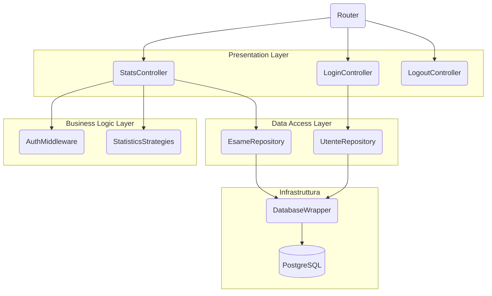
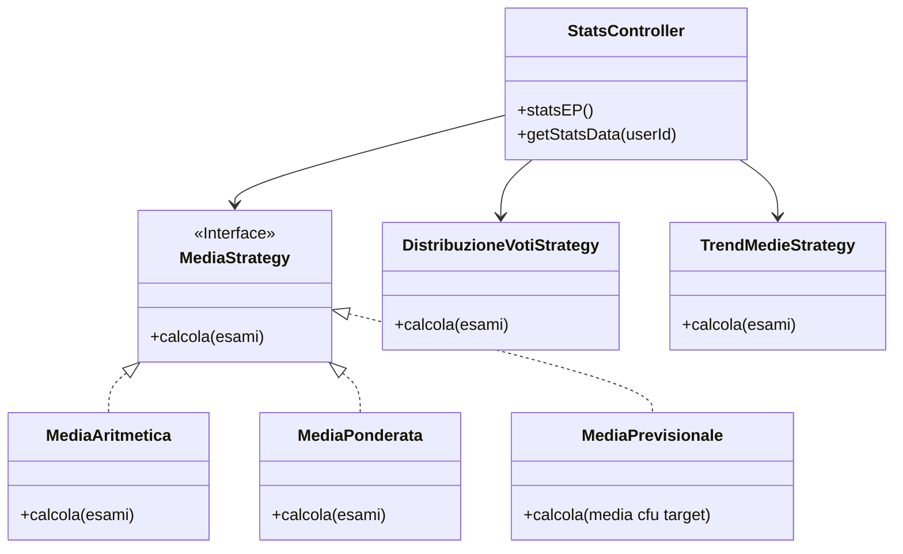
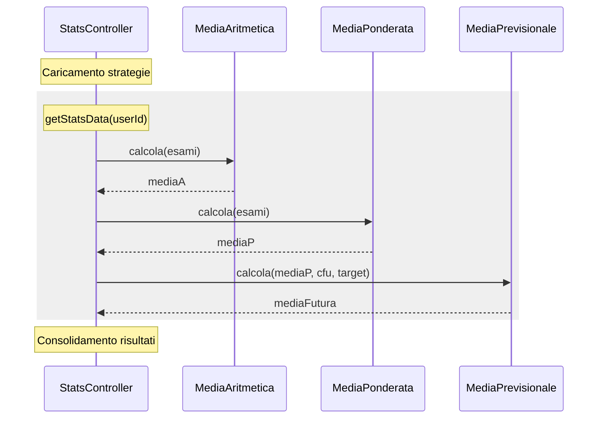
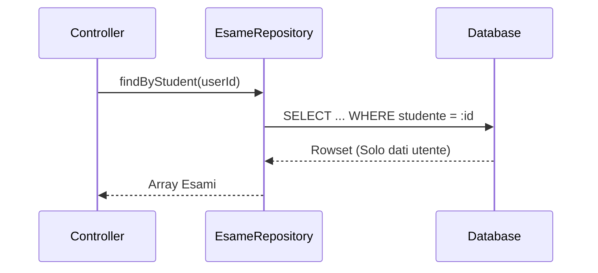
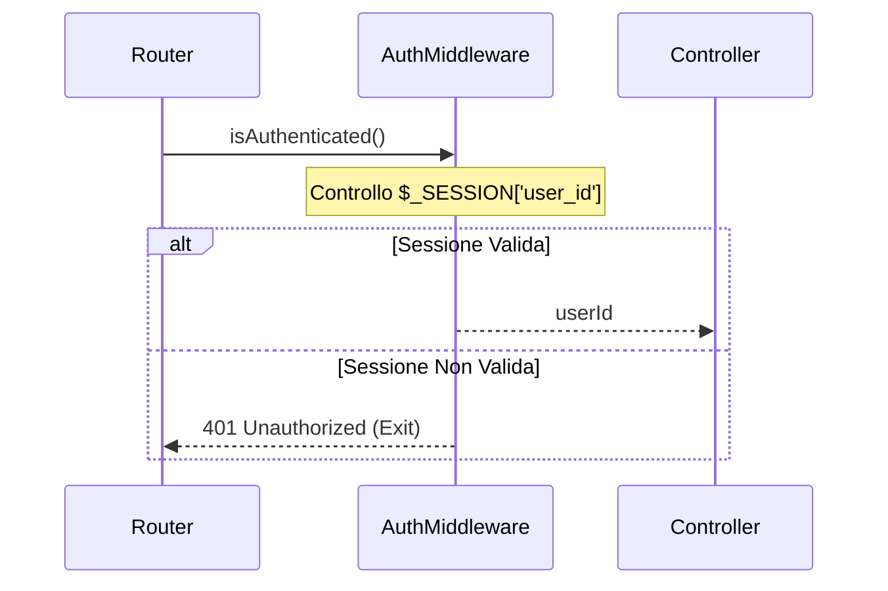
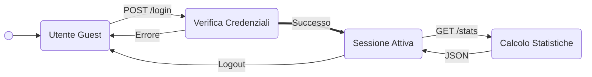
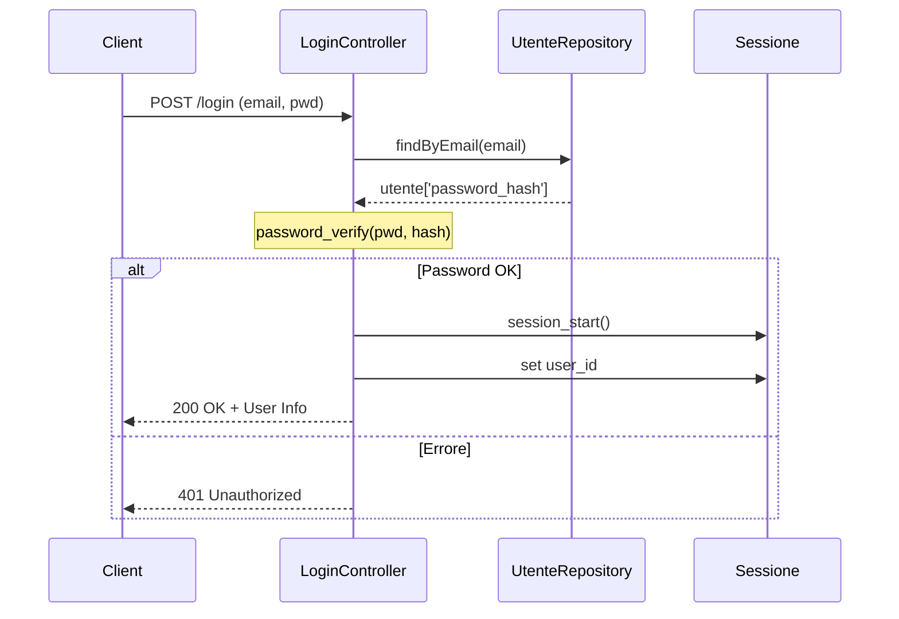
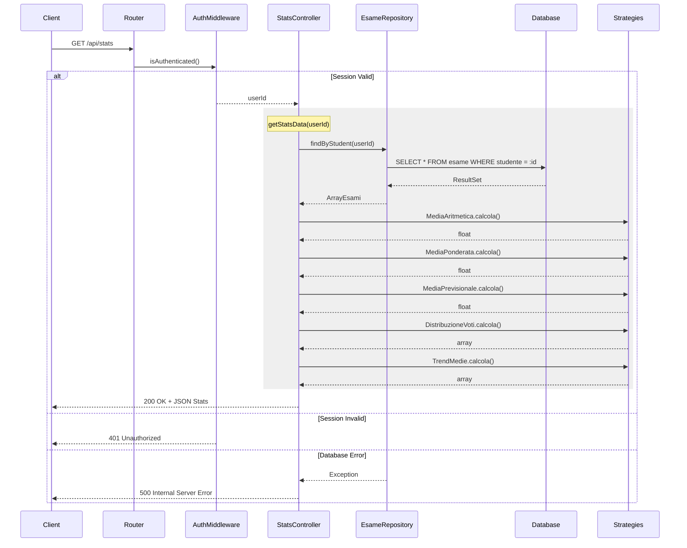
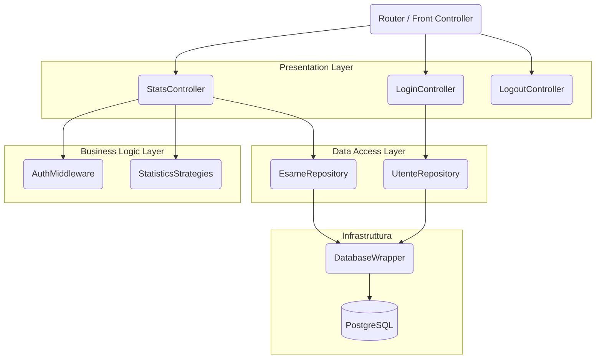

# Documentazione: Modulo Statistiche e Sicurezza

## Sommario

Questa documentazione fornisce un'analisi dettagliata dei moduli **Statistiche (Analytics)** e **Sicurezza (Auth)** del sistema 'Gestione Esami'. Il documento descrive i requisiti funzionali (come il calcolo delle medie, le proiezioni di laurea e l'analisi dei trend), l'architettura del sistema basata su tre layer, e l'integrazione di design pattern fondamentali quali **Strategy**, **Repository** e **Middleware**. Sono inoltre inclusi dettagli sul processo di sviluppo iterativo, le modifiche allo schema del database, l'implementazione degli endpoint API e i protocolli di testing e verifica.

## Indice

1. [Contesto del Progetto](#1-contesto-del-progetto)
   - 1.1 [Panoramica Generale](#11-panoramica-generale)
   - 1.2 [Ambito di Responsabilità](#12-ambito-di-responsabilità)
2. [Specifica e Analisi dei Requisiti](#2-specifica-e-analisi-dei-requisiti)
   - 2.1 [Requisiti Funzionali - Modulo Statistiche](#21-requisiti-funzionali---modulo-statistiche)
   - 2.2 [Requisiti Funzionali - Modulo Sicurezza](#22-requisiti-funzionali---modulo-sicurezza)
   - 2.3 [Requisiti Non Funzionali](#23-requisiti-non-funzionali)
3. [Processo di Sviluppo](#3-processo-di-sviluppo)
   - 3.1 [Metodologia Iterativa](#31-metodologia-iterativa)
   - 3.2 [Lavoro in Team](#32-lavoro-in-team)
4. [Architettura e Integrazione](#4-architettura-e-integrazione)
   - 4.1 [Architettura a 3 Layer (Contesto)](#41-architettura-a-3-layer-contesto)
   - 4.2 [Componenti da Me Sviluppati](#42-componenti-da-me-sviluppati)
   - 4.3 [Integrazione con Componenti Esistenti](#43-integrazione-con-componenti-esistenti)
5. [Design Pattern Implementati](#5-design-pattern-implementati)
   - 5.1 [Strategy Pattern (Statistiche)](#51-strategy-pattern-statistiche)
   - 5.2 [Repository Pattern (Data Access)](#52-repository-pattern-data-access)
   - 5.3 [Middleware Pattern (Sicurezza)](#53-middleware-pattern-sicurezza)
6. [Implementazione Dettagliata](#6-implementazione-dettagliata)
   - 6.1 [Endpoint API Implementati](#61-endpoint-api-implementati)
     - 6.1.1 [POST /api/login](#611-post-apilogin)
     - 6.1.2 [GET /api/stats](#612-get-apistats)
     - 6.1.3 [POST /api/logout](#613-post-apilogout)
   - 6.2 [Registrazione Endpoint](#62-registrazione-endpoint)
7. [Modifiche al Database](#7-modifiche-al-database)
   - 7.1 [Problema Iniziale](#71-problema-iniziale)
   - 7.2 [Soluzione Implementata](#72-soluzione-implementata)
   - 7.3 [Schema Finale (Estratto Rilevante)](#73-schema-finale-estratto-rilevante)
8. [Testing e Verifica](#8-testing-e-verifica)
   - 8.1 [Unit Testing](#81-unit-testing)
   - 8.2 [Esecuzione Test](#82-esecuzione-test)
   - 8.3 [Verifica Sintattica](#83-verifica-sintattica)
9. [Conclusioni](#9-conclusioni)
   - 9.1 [Tecnologie Utilizzate](#91-tecnologie-utilizzate)
   - 9.2 [Riepilogo Contributi](#92-riepilogo-contributi)
   - 9.3 [Riepilogo Diagrammi UML](#93-riepilogo-diagrammi-uml)

## 1. Contesto del Progetto

### 1.1 Panoramica Generale

Il sistema "Gestione Esami" è un'applicazione web per il tracciamento della carriera universitaria, sviluppata in team utilizzando:

- **Frontend**: Vanilla JavaScript con pattern MVP (Model-View-Presenter)
- **Backend**: PHP 8.0 con architettura a layer
- **Database**: PostgreSQL 13
- **Deployment**: Docker Compose (3 container: frontend, backend, db)

### 1.2 Ambito di Responsabilità

Il mio contributo al progetto si concentra su **due moduli backend**:

1. **Modulo Statistiche**: Sistema di calcolo e analisi delle performance accademiche
2. **Modulo Sicurezza**: Implementazione di autenticazione e multi-tenancy

**Componenti Sviluppati**:

- 5 Strategie di calcolo statistico
- Sistema di autenticazione (login/logout)
- Middleware di protezione endpoint
- Modifiche allo schema database per multi-utenza
- Unit test per le strategie

**Integrazione con Componenti Esistenti**:

- Utilizzo del `Router` esistente per registrare i nuovi endpoint
- Utilizzo di `DatabaseWrapper` per l'accesso ai dati
- Creazione di `Repository` specifici per i miei moduli

## 2. Specifica e Analisi dei Requisiti

### 2.1 Requisiti Funzionali - Modulo Statistiche

#### RF1: Calcolo Medie Base

- **RF1.1**: Il sistema deve calcolare la media aritmetica degli esami sostenuti
- **RF1.2**: Il sistema deve calcolare la media ponderata (pesata sui CFU)

**Giustificazione**: Le medie sono metriche fondamentali per valutare il rendimento accademico. La media ponderata è quella ufficialmente utilizzata per il calcolo del voto di laurea.

#### RF2: Proiezioni e Forecasting

- **RF2.1**: Il sistema deve proiettare il voto di laurea basandosi sulla media ponderata attuale
- **RF2.2**: Il sistema deve calcolare la media futura necessaria per raggiungere un obiettivo di laurea specifico

**Giustificazione**: Questi strumenti permettono allo studente di pianificare strategicamente la propria carriera, rispondendo alla domanda: *"Che media devo mantenere per laurearmi con 110?"*

#### RF3: Analisi Avanzate

- **RF3.1**: Il sistema deve fornire la distribuzione dei voti per fasce (18-21, 22-24, 25-27, 28-29, 30, 30L)
- **RF3.2**: Il sistema deve mostrare l'evoluzione temporale della media ponderata

**Giustificazione**: La distribuzione permette di valutare la costanza del rendimento, mentre il trend temporale evidenzia miglioramenti o peggioramenti nel tempo.

### 2.2 Requisiti Funzionali - Modulo Sicurezza

#### RF4: Autenticazione

- **RF4.1**: Il sistema deve autenticare gli utenti tramite email e password
- **RF4.2**: Il sistema deve mantenere sessioni sicure
- **RF4.3**: Il sistema deve permettere il logout con distruzione completa della sessione

**Giustificazione**: L'autenticazione è il prerequisito per implementare la multi-utenza in modo sicuro.

#### RF5: Multi-tenancy e Isolamento Dati

- **RF5.1**: Ogni utente deve visualizzare esclusivamente i propri esami
- **RF5.2**: Le query al database devono filtrare automaticamente per utente autenticato
- **RF5.3**: Non deve essere possibile accedere ai dati di altri utenti

**Giustificazione**: La privacy dei dati è un requisito fondamentale. L'isolamento deve essere garantito sia a livello applicativo che a livello di database.

### 2.3 Requisiti Non Funzionali

- **RNF1 (Performance)**: Le API statistiche devono rispondere entro 200ms per dataset tipici (< 50 esami)
- **RNF2 (Sicurezza)**: Le password devono essere hashate con bcrypt
- **RNF3 (Manutenibilità)**: Il codice deve seguire il principio Open/Closed (estensibile senza modifiche)
- **RNF4 (Testabilità)**: Ogni strategia di calcolo deve essere testabile indipendentemente

## 3. Processo di Sviluppo

### 3.1 Metodologia Iterativa

Ho seguito un approccio **iterativo e incrementale**:

**Iterazione 1 - Statistiche Base**:

1. Analisi dei requisiti RF1
2. Design del pattern Strategy
3. Implementazione `MediaAritmetica` e `MediaPonderata`
4. Testing manuale

**Iterazione 2 - Sicurezza e Forecasting**:

1. Analisi dei requisiti RF2, RF4, RF5
2. Design del Middleware Pattern
3. Implementazione autenticazione e `MediaPrevisionale`
4. Modifica schema database (aggiunta FK `studente`)

**Iterazione 3 - Analisi Avanzate**:

1. Analisi dei requisiti RF3
2. Implementazione `DistribuzioneVotiStrategy` e `TrendMedieStrategy`
3. Unit testing completo
4. Documentazione

### 3.2 Lavoro in Team

- **Git Flow**: Branch separati per lo sviluppo indipendente delle features
- **Integrazione**: Utilizzo dei componenti comuni (Router, DatabaseWrapper) sviluppati da altri membri

## 4. Architettura e Integrazione

### 4.1 Architettura a 3 Layer (Contesto)

Il backend del progetto segue un'architettura a 3 layer:

```
┌─────────────────────────────────────┐
│   Presentation Layer                │  ← API Controllers
├─────────────────────────────────────┤
│   Business Logic Layer              │  ← Strategies, Middleware (MIO LAVORO)
├─────────────────────────────────────┤
│   Data Access Layer                 │  ← Repositories (MODIFICATO), DatabaseWrapper
└─────────────────────────────────────┘
```

### 4.2 Componenti da Me Sviluppati

**Struttura File e Cartelle**:

```
src/server/
├── api/
│   ├── stats.php                    		# [MIO] Controller statistiche
│   ├── login.php                    		# [MIO] Controller autenticazione
│   ├── logout.php                   		# [MIO] Controller logout
│   ├── endpoints.txt                		# [MODIFICATO] Registrazione endpoint
│   ├── middleware/
│   │   └── AuthMiddleware.php       		# [MIO] Middleware autenticazione
│   └── strategies/
│       ├── MediaAritmetica.php      		# [MIO] Strategia media aritmetica
│       ├── MediaPonderata.php       		# [MIO] Strategia media ponderata
│       ├── MediaPrevisionale.php    		# [MIO] Strategia forecasting
│       ├── DistribuzioneVotiStrategy.php  	# [MIO] Strategia distribuzione
│       └── TrendMedieStrategy.php   		# [MIO] Strategia trend temporale
├── repository/
│   ├── EsameRepository.php          		# [MODIFICATO] Integrazione multi-tenancy
│   └── UtenteRepository.php         		# [MODIFICATO] Integrazione autenticazione
└── test/
    └── unit/
        └── StrategiesTest.php       		# [MIO] Unit test strategie

src/sql/
└── init.sql                         		# [MODIFICATO] Aggiunta FK studente
```

**Business Logic Layer**:

- `MediaAritmetica.php`
- `MediaPonderata.php`
- `MediaPrevisionale.php`
- `DistribuzioneVotiStrategy.php`
- `TrendMedieStrategy.php`
- `AuthMiddleware.php`

**Presentation Layer**:

- `stats.php` (Controller statistiche)
- `login.php` (Controller autenticazione)
- `logout.php` (Controller logout)

**Data Access Layer**:

- `EsameRepository.php` (Esteso con filtro per studente)
- `UtenteRepository.php` (Esteso con ricerca per email)

**Testing**:

- `StrategiesTest.php` (Unit test)

### 4.3 Integrazione con Componenti Esistenti

**Router** (sviluppato da altri):

- Ho registrato i miei endpoint in `endpoints.txt`
- Il Router gestisce il dispatching delle richieste ai miei controller

**DatabaseWrapper** (sviluppato da altri):

- Ho utilizzato i metodi `fetchAll()`, `fetchOne()`, `execute()` nei miei Repository
- Non ho modificato il wrapper, solo utilizzato
- Ho esteso `EsameRepository.php` e `UtenteRepository.php` con funzioni necessarie per garantire la segregazione dei dati

#### Diagramma di Componenti - Architettura dei Componenti

Il seguente diagramma mostra come i miei componenti si integrano con l'architettura esistente, organizzati per layer logici:



## 5. Design Pattern Implementati

### 5.1 Strategy Pattern (Statistiche)

**Problema**: La logica di calcolo varia (aritmetica, ponderata, previsionale, distribuzione, trend). Inserirla tutta nel controller violerebbe il Single Responsibility Principle e renderebbe il codice difficile da testare e estendere.

**Soluzione**: Incapsulare ogni algoritmo in una classe dedicata.

#### Diagramma di Classi - Struttura Strategy Pattern

Il seguente diagramma UML mostra la struttura completa del pattern Strategy implementato:



#### Diagramma di Sequenza - Esecuzione Strategie Statistiche

Questo diagramma descrive come il controller interagisce con le diverse strategie per ottenere i calcoli:



#### Implementazione

**Interfaccia Comune** (per strategie base):

**Scopo**: Definire un contratto comune per tutte le strategie di calcolo che operano su array di esami. Questo permette al controller di utilizzare qualsiasi strategia in modo intercambiabile (polimorfismo).

```php
// src/server/api/strategies/MediaStrategy.php
interface MediaStrategy {
    public function calcola(array $esami): float;
}
```

**Strategia 1: Media Aritmetica**

**Logica**: Calcola la media semplice sommando tutti i voti e dividendo per il numero di esami. Questo è il calcolo più basilare e non tiene conto dei CFU.

**Scopo**: Fornire una metrica rapida del rendimento generale dello studente, utile per confronti informali ma non per il voto di laurea.

```php
// src/server/api/strategies/MediaAritmetica.php
class MediaAritmetica implements MediaStrategy {
    public function calcola(array $esami): float {
        if (empty($esami)) return 0;
  
        $somma = 0;
        foreach ($esami as $esame) {
            $somma += $esame['voto'];
        }
  
        return $somma / count($esami);
    }
}
```

**Formula**: `Media = Σ(voti) / N`

**Strategia 2: Media Ponderata**

**Logica**: Calcola la media pesata sui CFU. Ogni voto viene moltiplicato per i suoi CFU, poi si somma tutto e si divide per il totale dei CFU. Questa è la media ufficiale usata per il voto di laurea.

**Scopo**: Fornire la metrica più importante per la carriera accademica, poiché esami con più CFU hanno maggiore impatto sulla media finale.

```php
// src/server/api/strategies/MediaPonderata.php
class MediaPonderata implements MediaStrategy {
    public function calcola(array $esami): float {
        if (empty($esami)) return 0;
  
        $sommaPonderata = 0;
        $totCFU = 0;
  
        foreach ($esami as $esame) {
            $sommaPonderata += ($esame['voto'] * $esame['cfu']);
            $totCFU += $esame['cfu'];
        }
  
        return $totCFU > 0 ? $sommaPonderata / $totCFU : 0;
    }
}
```

**Formula**: `Media Ponderata = Σ(voto × CFU) / Σ(CFU)`

**Strategia 3: Media Previsionale (Forecasting)**

**Logica**: Utilizza una formula inversa per calcolare quale media futura è necessaria sui CFU rimanenti per raggiungere un target di laurea (es. 110/110). La formula parte dal target, sottrae il "peso" già accumulato, e divide per i CFU mancanti.

**Scopo**: Permettere allo studente di pianificare strategicamente la propria carriera rispondendo alla domanda: "Che media devo mantenere per laurearmi con 110?"

```php
// src/server/api/strategies/MediaPrevisionale.php
class MediaPrevisionale {
    /**
     * Calcola la media futura necessaria per raggiungere un target di laurea.
     * 
     * Formula Inversa:
     * TargetMedia = (TargetVotoLaurea × 30) / 110
     * MediaFutura = (TargetMedia × TotCFU - MediaCorrente × CFUFatti) / CFUMancanti
     */
    public function calcola(float $mediaCorrente, int $cfuFatti, int $cfuTotali, int $targetVoto): float {
        $cfuMancanti = $cfuTotali - $cfuFatti;
  
        if ($cfuMancanti <= 0) {
            return 0; // Corso completato
        }
  
        $targetMedia = ($targetVoto * 30) / 110;
        $mediaFutura = (($targetMedia * $cfuTotali) - ($mediaCorrente * $cfuFatti)) / $cfuMancanti;
  
        return round($mediaFutura, 2);
    }
}
```

**Esempio di Calcolo**:

- Media attuale: 26.86
- CFU fatti: 120
- CFU totali corso: 180
- Target: 110/110
- **Risultato**: Media futura necessaria = 30.41 (matematicamente impossibile, serve 110L)

**Strategia 4: Distribuzione Voti**

**Logica**: Categorizza ogni voto in fasce predefinite (18-21, 22-24, 25-27, 28-29, 30, 30L) e conta quanti esami rientrano in ciascuna fascia. Gestisce anche il caso speciale della lode.

**Scopo**: Fornire una vista statistica sulla "costanza" del rendimento. Permette di capire se lo studente ha voti concentrati in una fascia o distribuiti uniformemente.

```php
// src/server/api/strategies/DistribuzioneVotiStrategy.php
class DistribuzioneVotiStrategy {
    public function calcola(array $esami): array {
        $distribuzione = [
            '18-21' => 0,
            '22-24' => 0,
            '25-27' => 0,
            '28-29' => 0,
            '30'    => 0,
            '30L'   => 0
        ];

        foreach ($esami as $esame) {
            $voto = intval($esame['voto']);
            $lode = isset($esame['lode']) && $esame['lode'] == 1;

            if ($voto == 30 && $lode) {
                $distribuzione['30L']++;
            } elseif ($voto == 30) {
                $distribuzione['30']++;
            } elseif ($voto >= 28) {
                $distribuzione['28-29']++;
            } elseif ($voto >= 25) {
                $distribuzione['25-27']++;
            } elseif ($voto >= 22) {
                $distribuzione['22-24']++;
            } elseif ($voto >= 18) {
                $distribuzione['18-21']++;
            }
        }

        return $distribuzione;
    }
}
```

**Output Esempio**: `{"18-21": 0, "22-24": 3, "25-27": 5, "28-29": 8, "30": 4, "30L": 1}`

**Strategia 5: Trend Temporale**

**Logica**: Ordina gli esami per data cronologica e calcola la media ponderata progressiva dopo ogni esame. Questo crea una "timeline" che mostra come la media è evoluta nel tempo.

**Scopo**: Identificare trend di miglioramento o peggioramento nel rendimento. Utile per capire se lo studente sta migliorando con il tempo o se ci sono stati periodi critici.

```php
// src/server/api/strategies/TrendMedieStrategy.php
class TrendMedieStrategy {
    public function calcola(array $esami): array {
        // Ordina per data
        usort($esami, function($a, $b) {
            return strcmp($a['data'], $b['data']);
        });

        $trend = [];
        $sommaPonderata = 0;
        $totCFU = 0;

        foreach ($esami as $esame) {
            $voto = $esame['voto'];
            $cfu = $esame['cfu'];
  
            if ($voto < 18) continue; 

            $sommaPonderata += ($voto * $cfu);
            $totCFU += $cfu;

            $mediaCorrente = $totCFU > 0 ? $sommaPonderata / $totCFU : 0;
  
            $trend[] = [
                'data' => $esame['data'],
                'esame' => $esame['nome'],
                'media_progressiva' => round($mediaCorrente, 2)
            ];
        }

        return $trend;
    }
}
```

**Output Esempio**:

```json
[
  {"data": "2023-01-15", "esame": "Analisi 1", "media_progressiva": 28.0},
  {"data": "2023-02-20", "esame": "Fisica", "media_progressiva": 27.5},
  {"data": "2023-06-10", "esame": "Programmazione", "media_progressiva": 27.8}
]
```

**Vantaggi del Pattern**:

1. **Open/Closed Principle**: Posso aggiungere nuove strategie senza modificare il controller
2. **Single Responsibility**: Ogni classe ha una sola ragione per cambiare
3. **Testabilità**: Posso testare ogni strategia indipendentemente

### 5.2 Repository Pattern (Data Access)

**Problema**: Senza un layer di astrazione, le query SQL sarebbero sparse nei controller, rendendo difficile la manutenzione e il testing.

**Soluzione**: Centralizzare tutte le query in classi Repository.

#### Diagramma di Sequenza - Accesso ai Dati (Isolamento)

Mostra l'isolamento dei dati grazie alla clausola WHERE nel repository:



> [!NOTE]
> I file `EsameRepository.php` e `UtenteRepository.php` sono stati inizialmente implementati da un collega. Il mio intervento si è focalizzato sull'estensione delle loro funzionalità per supportare i requisiti di sicurezza e multi-utenza.

#### EsameRepository

**Modifiche Apportate**:

- **Aggiunta del metodo `findByStudent(int $studenteId)`**: Questo metodo è fondamentale per la **multi-tenancy**. Mentre l'implementazione originale prevedeva un recupero totale (`all()`), ho aggiunto questa funzione per garantire che ogni utente possa accedere esclusivamente ai propri dati.

```php
// src/server/repository/EsameRepository.php
// METODO AGGIUNTO DA ME
public function findByStudent(int $studenteId): array {
    return $this->db->fetchAll(
        "SELECT * FROM applicazione.esame WHERE studente = :id ORDER BY data DESC", 
        ['id' => $studenteId]
    );
}
```

#### UtenteRepository

**Modifiche Apportate**:

- **Aggiunta del metodo `findByEmail(string $email)`**: Necessario per il modulo di **Autenticazione**. Permette al controller di login di recuperare l'utente corretto per poi procedere alla verifica della password hashata.

```php
// src/server/repository/UtenteRepository.php
// METODO AGGIUNTO DA ME
public function findByEmail(string $email): ?array {
    return $this->db->fetchOne(
        'SELECT * FROM applicazione.utente WHERE email = :email',
        ['email' => $email]
    );
}
```

**Vantaggi**:

- **Centralizzazione**: Tutte le query in un unico posto
- **Riusabilità**: Posso usare `findByStudent` da qualsiasi controller
- **Testing**: Posso mockare il repository nei test

### 5.3 Middleware Pattern (Sicurezza)

**Problema**: Duplicazione del codice di controllo sessione in ogni endpoint protetto. Rischio di dimenticare la protezione su nuove API.

**Soluzione**: Creare un componente che intercetta tutte le richieste prima del controller.

#### Diagramma di Sequenza - Intercezione Middleware

Descrive come il middleware protegge l'accesso alle risorse riservate:



#### Diagramma di Stato - Ciclo di Vita della Sessione

Il seguente diagramma mostra la struttura logica della sessione utente:



#### Implementazione AuthMiddleware

**Logica**: Controlla se esiste una variabile `$_SESSION['user_id']`. Se non esiste, significa che l'utente non è autenticato, quindi blocca la richiesta con un 401. Se esiste, restituisce l'ID utente al controller.

**Scopo**: Evitare duplicazione del codice di autenticazione in ogni endpoint. Centralizza la logica di sicurezza in un unico punto.

```php
// src/server/api/middleware/AuthMiddleware.php
class AuthMiddleware {
    /**
     * Verifica se l'utente è autenticato.
     * Se no, termina la richiesta con 401.
     * Se sì, restituisce l'ID utente.
     */
    public static function isAuthenticated(): int {
        session_start();
  
        if (!isset($_SESSION['user_id'])) {
            http_response_code(401);
            echo json_encode(['error' => 'Non autorizzato']);
            exit; // Blocca l'esecuzione
        }
  
        return $_SESSION['user_id'];
    }
}
```

**Utilizzo nel Controller**:

```php
// src/server/api/stats.php
function statsEP(): void {
    header('Content-Type: application/json');

    // Prima riga: controllo autenticazione
    $userId = AuthMiddleware::isAuthenticated();
  
    // Se arriviamo qui, l'utente è autenticato
    $esami = $esameRepo->findByStudent($userId); // Query filtrata
    // ...
}
```

**Vantaggi**:

- **DRY**: Il codice di autenticazione è scritto una sola volta
- **Sicurezza**: Impossibile dimenticare il controllo
- **Manutenibilità**: Modifiche alla logica di auth in un solo punto

## 6. Implementazione Dettagliata

### 6.1 Endpoint API Implementati

#### 6.1.1 POST /api/login

**Scopo**: Autenticare un utente e creare una sessione sicura.

**Logica**:

1. Riceve email e password dal client (JSON)
2. Cerca l'utente nel database tramite `UtenteRepository`
3. Verifica la password usando `password_verify()` (confronto con hash bcrypt)
4. Se valido, crea una sessione PHP e salva `user_id` in `$_SESSION`
5. Rigenera l'ID sessione per prevenire Session Fixation attacks

#### Diagramma di Sequenza - Flusso di Login

Dettaglio dell'interazione durante la creazione della sessione:



#### Implementazione

```php
// src/server/api/login.php
require_once dirname(__DIR__) . '/config/DatabasePDO.php';
require_once dirname(__DIR__) . '/config/DatabaseWrapper.php';
require_once dirname(__DIR__) . '/repository/UtenteRepository.php';

function loginEP() {
    header('Content-Type: application/json');
  
    $input = json_decode(file_get_contents('php://input'), true);
    $email = $input['email'] ?? '';
    $password = $input['password'] ?? '';

    if (empty($email) || empty($password)) {
        http_response_code(400);
        echo json_encode(['error' => 'Missing credentials']);
        return;
    }

    try {
        $db = new DatabaseWrapper((new DatabasePDO())->pdo());
        $utenteRepo = new UtenteRepository($db);
  
        $utente = $utenteRepo->findByEmail($email);
  
        if (!$utente || !password_verify($password, $utente['password_hash'])) {
            http_response_code(401);
            echo json_encode(['error' => 'Credenziali non valide']);
            return;
        }

        // Autenticazione riuscita
        session_start();
        session_regenerate_id(true); // Prevenzione Session Fixation
        $_SESSION['user_id'] = $utente['utente_id'];
        $_SESSION['email'] = $utente['email'];

        echo json_encode([
            'success' => true,
            'user' => [
                'id' => $utente['utente_id'],
                'nome' => $utente['nome'],
                'cognome' => $utente['cognome']
            ]
        ]);
    } catch (Exception $e) {
        http_response_code(500);
        echo json_encode(['error' => 'Errore del server']);
    }
}
```

**Sicurezza Implementata**:

1. **Password Hashing**: Uso `password_verify()` per confrontare hash bcrypt (non salvo password in chiaro)
2. **Session Regeneration**: `session_regenerate_id(true)` previene Session Fixation attacks
3. **Input Validation**: Controllo che email e password non siano vuoti
4. **Error Handling**: Non rivelo se l'errore è email o password errata (prevenzione user enumeration)

#### 6.1.2 GET /api/stats

**Scopo**: Restituire tutte le statistiche dell'utente autenticato.

**Logica**:

1. Verifica autenticazione tramite `AuthMiddleware` (ottiene `userId`)
2. Recupera gli esami dello studente dal database (query filtrata)
3. Istanzia tutte e 5 le strategie di calcolo
4. Esegue i calcoli in sequenza
5. Costruisce un JSON con tutti i risultati
6. Gestisce errori con try-catch (500 in caso di eccezioni)

```php
// src/server/api/stats.php
require_once dirname(__DIR__) . '/config/DatabasePDO.php';
require_once dirname(__DIR__) . '/config/DatabaseWrapper.php';
require_once __DIR__ . '/strategies/MediaAritmetica.php';
require_once __DIR__ . '/strategies/MediaPonderata.php';
require_once __DIR__ . '/strategies/MediaPrevisionale.php';
require_once __DIR__ . '/strategies/DistribuzioneVotiStrategy.php';
require_once __DIR__ . '/strategies/TrendMedieStrategy.php';
require_once __DIR__ . '/middleware/AuthMiddleware.php';
require_once dirname(__DIR__) . '/repository/EsameRepository.php';

function statsEP(): void {
    header('Content-Type: application/json');

    $userId = AuthMiddleware::isAuthenticated();

    try {
        $data = getStatsData($userId);
        echo json_encode($data);
    } catch (Exception $e) {
        http_response_code(500);
        echo json_encode(['error' => 'Internal Server Error']);
    }
}

/**
 * Funzione di supporto per il calcolo dei dati statistici.
 * Isola la logica di business per favorire la compatibilità con ResponseInterface.
 */
function getStatsData(int $userId): array {
    $db = new DatabaseWrapper((new DatabasePDO())->pdo());
    $esameRepo = new EsameRepository($db);
    $esami = $esameRepo->findByStudent($userId);

    // Istanziazione strategie
    $distribuzioneStrategy = new DistribuzioneVotiStrategy();
    $trendStrategy = new TrendMedieStrategy();
    $mediaAritmeticaStrategy = new MediaAritmetica();
    $mediaPonderataStrategy = new MediaPonderata();
    $mediaPrevisionaleStrategy = new MediaPrevisionale();

    // Calcoli
    $mediaA = $mediaAritmeticaStrategy->calcola($esami);
    $mediaP = $mediaPonderataStrategy->calcola($esami);
    $distribuzione = $distribuzioneStrategy->calcola($esami);
    $trend = $trendStrategy->calcola($esami);
  
    $totCFU = 0;
    foreach ($esami as $e) {
        $totCFU += $e['cfu'];
    }

    $proiezione = ($mediaP * 110) / 30;
    $cfuTotaliCorso = 180; 
    $mediaFutura = $mediaPrevisionaleStrategy->calcola($mediaP, $totCFU, $cfuTotaliCorso, 110);

    return [
        'mediaA' => round($mediaA, 2),
        'mediaP' => round($mediaP, 2),
        'proiezione' => round($proiezione, 2),
        'cfuTotali' => $totCFU,
        'previsione110' => $mediaFutura,
        'distribuzioneVoti' => $distribuzione,
        'trendMedia' => $trend
    ];
}
```

**Esempio di Risposta JSON**:

```json
{
  "mediaA": 27.33,
  "mediaP": 26.86,
  "proiezione": 98.48,
  "cfuTotali": 120,
  "previsione110": 30.41,
  "distribuzioneVoti": {
    "18-21": 0,
    "22-24": 3,
    "25-27": 5,
    "28-29": 8,
    "30": 4,
    "30L": 1
  },
  "trendMedia": [
    {"data": "2023-01-15", "esame": "Analisi 1", "media_progressiva": 28.0},
    {"data": "2023-02-20", "esame": "Fisica", "media_progressiva": 27.5}
  ]
}
```

#### Diagramma di Sequenza - Flusso Completo API Statistiche

Il seguente diagramma mostra il flusso completo di una richiesta all'endpoint `/api/stats`, includendo autenticazione, accesso al database, esecuzione delle strategie e gestione degli errori:



**Punti Chiave del Flusso**:

1. Il Middleware intercetta la richiesta prima del controller
2. La query al database è sempre filtrata per `userId` (sicurezza)
3. Tutte e 5 le strategie vengono eseguite in sequenza
4. Gestione di 3 scenari: successo, autenticazione fallita, errore database

#### 6.1.3 POST /api/logout

**Scopo**: Distruggere la sessione utente in modo sicuro.

**Logica**:

1. Avvia la sessione per accedere ai dati
2. Svuota l'array `$_SESSION`
3. Elimina il cookie di sessione dal browser del client
4. Distrugge la sessione lato server con `session_destroy()`

Questo garantisce che non rimangano tracce della sessione né lato client né lato server.

```php
// src/server/api/logout.php
function logoutEP() {
    header('Content-Type: application/json');
  
    session_start();
    $_SESSION = array(); // Svuota tutte le variabili di sessione
  
    if (ini_get("session.use_cookies")) {
        $params = session_get_cookie_params();
        setcookie(session_name(), '', time() - 42000,
            $params["path"], $params["domain"],
            $params["secure"], $params["httponly"]
        );
    }
  
    session_destroy();
  
    echo json_encode(['success' => true]);
}
```

**Sicurezza**: Distruggo sia la sessione server-side che il cookie client-side.

### 6.2 Registrazione Endpoint

Ho aggiunto i miei endpoint al file di configurazione del Router:

```
// src/server/api/endpoints.txt
login POST loginEP
logout POST logoutEP
stats GET statsEP
```

Il Router (sviluppato da altri) legge questo file e mappa automaticamente le richieste.

## 7. Modifiche al Database

### 7.1 Problema Iniziale

Lo schema database originale non supportava la multi-utenza. La tabella `esame` non aveva alcuna relazione con `utente`, rendendo impossibile filtrare gli esami per studente.

### 7.2 Soluzione Implementata

**Logica**: Aggiunta di una colonna `studente` che referenzia la tabella `utente`. Questo crea una relazione 1-to-N (un utente ha molti esami).

**Scopo**: Abilitare la multi-utenza permettendo di filtrare gli esami per studente. Senza questa modifica, tutti gli esami sarebbero visibili a tutti.

Ho modificato lo schema aggiungendo una Foreign Key:

```sql
-- src/sql/init.sql (modifica da me apportata)
ALTER TABLE "applicazione"."esame" 
ADD COLUMN "studente" INTEGER NOT NULL 
DEFAULT 1 
REFERENCES "applicazione"."utente"("utente_id") 
ON DELETE CASCADE;
```

**Spiegazione**:

- `studente INTEGER`: Nuova colonna che referenzia l'ID utente
- `NOT NULL`: Ogni esame deve appartenere a uno studente
- `DEFAULT 1`: Per compatibilità con dati esistenti durante la migrazione
- `REFERENCES "applicazione"."utente"("utente_id")`: Foreign Key constraint
- `ON DELETE CASCADE`: Se elimino uno studente, elimino anche i suoi esami (integrità referenziale)

### 7.3 Schema Finale (Estratto Rilevante)

```sql
-- Tabella utente (esistente, non modificata da me)
CREATE TABLE "applicazione"."utente" (
    "utente_id" SERIAL PRIMARY KEY,
    "nome" VARCHAR(50) NOT NULL,
    "cognome" VARCHAR(50) NOT NULL,
    "email" VARCHAR(100) UNIQUE NOT NULL,
    "password_hash" VARCHAR(255) NOT NULL
);

-- Tabella esame (modificata da me con aggiunta colonna studente)
CREATE TABLE "applicazione"."esame" (
    "esame_id" SERIAL PRIMARY KEY,
    "corso" INTEGER NOT NULL,
    "voto" INTEGER NOT NULL CHECK (voto >= 18 AND voto <= 30),
    "cfu" INTEGER NOT NULL,
    "data" DATE NOT NULL,
    "lode" BOOLEAN DEFAULT FALSE,
    "studente" INTEGER NOT NULL REFERENCES "applicazione"."utente"("utente_id") ON DELETE CASCADE
);
```

**Impatto della Modifica**:

- Ora posso eseguire query filtrate: `SELECT * FROM esame WHERE studente = :userId`
- L'isolamento dei dati è garantito a livello di database
- Integrità referenziale automatica

## 8. Testing e Verifica

### 8.1 Unit Testing

Ho implementato unit test per verificare la correttezza di tutte le strategie di calcolo.

```php
// src/server/test/unit/StrategiesTest.php
<?php
require_once dirname(dirname(__DIR__)) . '/api/strategies/MediaAritmetica.php';
require_once dirname(dirname(__DIR__)) . '/api/strategies/MediaPonderata.php';
require_once dirname(dirname(__DIR__)) . '/api/strategies/MediaPrevisionale.php';
require_once dirname(dirname(__DIR__)) . '/api/strategies/DistribuzioneVotiStrategy.php';
require_once dirname(dirname(__DIR__)) . '/api/strategies/TrendMedieStrategy.php';

function assertEqual($expected, $actual, $message) {
    if (abs($expected - $actual) < 0.01) {
        echo "PASS: $message\n";
    } else {
        echo "FAIL: $message (Atteso: $expected, Ottenuto: $actual)\n";
    }
}

echo "Esecuzione Unit Test delle Strategie...\n\n";

// Setup Data
$esami = [
    ['voto' => 30, 'cfu' => 6],
    ['voto' => 24, 'cfu' => 9],
    ['voto' => 28, 'cfu' => 6]
];

// Test Media Aritmetica: (30+24+28)/3 = 27.33
$stratA = new MediaAritmetica();
$resA = $stratA->calcola($esami);
assertEqual(27.33, $resA, "La Media Aritmetica dovrebbe essere ~27.33");

// Test Media Ponderata: (30*6 + 24*9 + 28*6) / (6+9+6) = 564/21 = 26.86
$stratP = new MediaPonderata();
$resP = $stratP->calcola($esami);
assertEqual(26.86, $resP, "La Media Ponderata dovrebbe essere ~26.86");

// Test Media Previsionale
$stratPrev = new MediaPrevisionale();
$resPrev = $stratPrev->calcola(26.86, 21, 180, 110);
assertEqual(30.41, $resPrev, "La previsione per il 110 dovrebbe essere ~30.41");

// Test Distribuzione Voti
$stratDist = new DistribuzioneVotiStrategy();
$resDist = $stratDist->calcola($esami);
assertEqual(1, $resDist['28-29'], "Dovrebbe esserci 1 esame nella fascia 28-29");
assertEqual(1, $resDist['22-24'], "Dovrebbe esserci 1 esame nella fascia 22-24");
assertEqual(1, $resDist['30'], "Dovrebbe esserci 1 esame con voto 30");

// Test Trend
$esamiTrend = [
    ['voto' => 24, 'cfu' => 6, 'data' => '2023-01-01', 'nome' => 'A'],
    ['voto' => 28, 'cfu' => 6, 'data' => '2023-06-01', 'nome' => 'B']
];
$stratTrend = new TrendMedieStrategy();
$resTrend = $stratTrend->calcola($esamiTrend);

assertEqual(24.0, $resTrend[0]['media_progressiva'], "La media del primo punto del trend dovrebbe essere 24");
assertEqual(26.0, $resTrend[1]['media_progressiva'], "La media del secondo punto del trend dovrebbe essere 26");

echo "\nTest Completati.\n";
```

### 8.2 Esecuzione Test

```bash
$ php src/server/test/unit/StrategiesTest.php
Esecuzione Unit Test delle Strategie...

PASS: La Media Aritmetica dovrebbe essere ~27.33
PASS: La Media Ponderata dovrebbe essere ~26.86
PASS: La previsione per il 110 dovrebbe essere ~30.41
PASS: Dovrebbe esserci 1 esame nella fascia 28-29
PASS: Dovrebbe esserci 1 esame nella fascia 22-24
PASS: Dovrebbe esserci 1 esame con voto 30
PASS: La media del primo punto del trend dovrebbe essere 24
PASS: La media del secondo punto del trend dovrebbe essere 26

Test Completati.
```

**Tutti i test passano**, confermando la correttezza degli algoritmi.

### 8.3 Verifica Sintattica

```bash
$ php -l src/server/api/stats.php
No syntax errors detected in src/server/api/stats.php

$ php -l src/server/api/login.php
No syntax errors detected in src/server/api/login.php

$ php -l src/server/repository/EsameRepository.php
No syntax errors detected in src/server/repository/EsameRepository.php

$ php -l src/server/repository/UtenteRepository.php
No syntax errors detected in src/server/repository/UtenteRepository.php
```

## 9. Conclusioni

### 9.1 Tecnologie Utilizzate

- **Backend**: PHP 8.0, PDO, Sessions
- **Database**: PostgreSQL 13
- **Testing**: PHP Unit Testing (custom)
- **Deployment**: Docker Compose

### 9.2 Riepilogo Contributi

**File Creati**:

- `src/server/api/stats.php`
- `src/server/api/login.php`
- `src/server/api/logout.php`
- `src/server/api/middleware/AuthMiddleware.php`
- `src/server/api/strategies/MediaAritmetica.php`
- `src/server/api/strategies/MediaPonderata.php`
- `src/server/api/strategies/MediaPrevisionale.php`
- `src/server/api/strategies/DistribuzioneVotiStrategy.php`
- `src/server/api/strategies/TrendMedieStrategy.php`
- `src/server/test/unit/StrategiesTest.php`

**File Modificati**:

- `src/sql/init.sql` (aggiunta colonna `studente`)
- `src/server/api/endpoints.txt` (registrazione endpoint)
- `src/server/EsameRepository.php`  (Esteso con filtro per studente)
- `src/server/UtenteRepository.php`  (Esteso con ricerca per email)

**Design Pattern Applicati**:

- Strategy Pattern (5 strategie)
- Repository Pattern (2 repository)
- Middleware Pattern (1 middleware)

### 9.3 Riepilogo Diagrammi UML

Di seguito vengono riportati tutti i diagrammi realizzati per la modellazione del sistema, raccolti per una visione d'insieme:

#### Diagramma di Componenti - Architettura dei Componenti



#### Diagramma di Classi - Struttura Strategy Pattern


#### Diagramma di Stato - Ciclo di Vita della Sessione


#### Diagramma di Sequenza - Flusso Completo API Statistiche


#### Altri Diagrammi di Sequenza

- Visualizza Dettagli (Login, Middleware, Data Access, Strategie)

**Diagramma di Sequenza - Flusso di Login**


**Diagramma di Sequenza - Intercezione Middleware**


**Diagramma di Sequenza - Accesso ai Dati (Isolamento)**


**Diagramma di Sequenza - Esecuzione Strategie Statistiche**


